# Little Monster - Architecture Diagrams

## Document Control
- **Version**: 1.0
- **Date**: November 1, 2025
- **Purpose**: Visual diagrams for architecture documentation
- **Related**: TECHNICAL-ARCHITECTURE.md, IMPLEMENTATION-ROADMAP.md

---

## Table of Contents
1. [Authentication Flows](#authentication-flows)
2. [Async Job Processing](#async-job-processing)
3. [Service Communication](#service-communication)
4. [Data Flow](#data-flow)
5. [Deployment Diagrams](#deployment-diagrams)

---

## Authentication Flows

### User Registration Flow

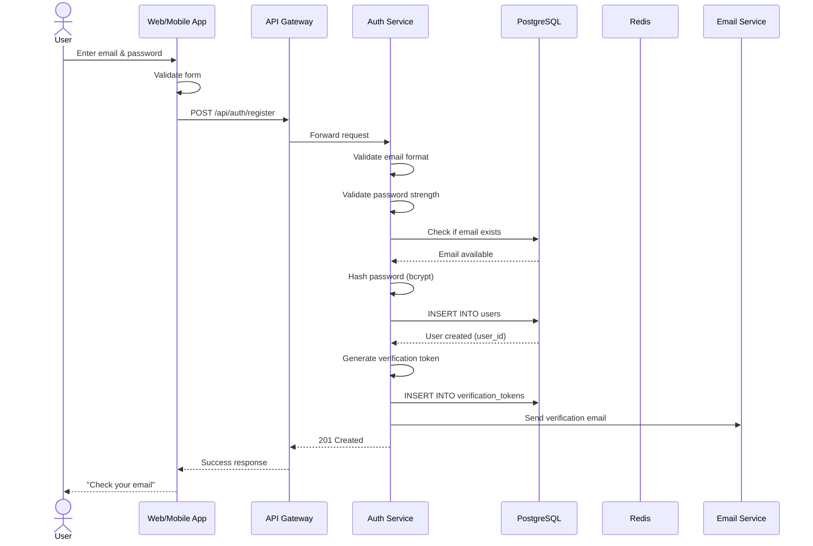
```mermaid
sequenceDiagram
    actor User
    participant WebApp as Web/Mobile App
    participant Gateway as API Gateway
    participant Auth as Auth Service
    participant DB as PostgreSQL
    participant Redis
    participant Email as Email Service
    
    User->>WebApp: Enter email & password
    WebApp->>WebApp: Validate form
    WebApp->>Gateway: POST /api/auth/register
    Gateway->>Auth: Forward request
    
    Auth->>Auth: Validate email format
    Auth->>Auth: Validate password strength
    Auth->>DB: Check if email exists
    DB-->>Auth: Email available
    
    Auth->>Auth: Hash password (bcrypt)
    Auth->>DB: INSERT INTO users
    DB-->>Auth: User created (user_id)
    
    Auth->>Auth: Generate verification token
    Auth->>DB: INSERT INTO verification_tokens
    Auth->>Email: Send verification email
    
    Auth-->>Gateway: 201 Created
    Gateway-->>WebApp: Success response
    WebApp-->>User: "Check your email"
```

### User Login Flow

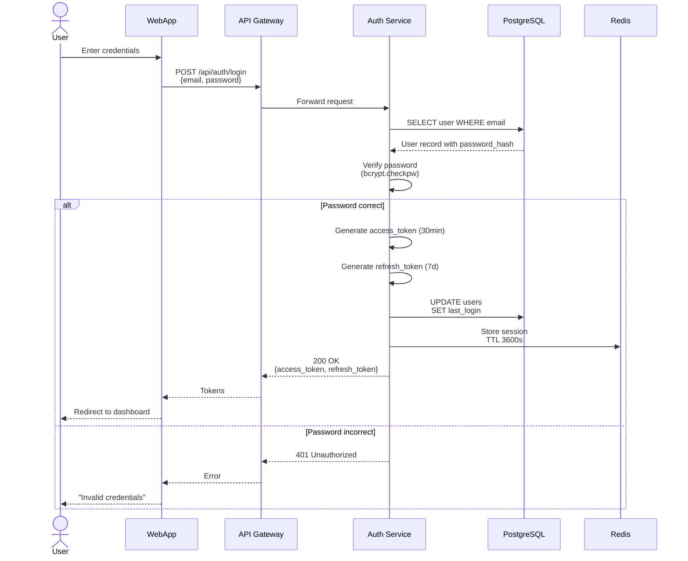
```mermaid
sequenceDiagram
    actor User
    participant WebApp
    participant Gateway as API Gateway
    participant Auth as Auth Service
    participant DB as PostgreSQL
    participant Redis
    
    User->>WebApp: Enter credentials
    WebApp->>Gateway: POST /api/auth/login<br/>{email, password}
    Gateway->>Auth: Forward request
    
    Auth->>DB: SELECT user WHERE email
    DB-->>Auth: User record with password_hash
    
    Auth->>Auth: Verify password<br/>(bcrypt.checkpw)
    
    alt Password correct
        Auth->>Auth: Generate access_token (30min)
        Auth->>Auth: Generate refresh_token (7d)
        Auth->>DB: UPDATE users<br/>SET last_login
        Auth->>Redis: Store session<br/>TTL 3600s
        Auth-->>Gateway: 200 OK<br/>{access_token, refresh_token}
        Gateway-->>WebApp: Tokens
        WebApp-->>User: Redirect to dashboard
    else Password incorrect
        Auth-->>Gateway: 401 Unauthorized
        Gateway-->>WebApp: Error
        WebApp-->>User: "Invalid credentials"
    end
```

### OAuth2 Social Login Flow

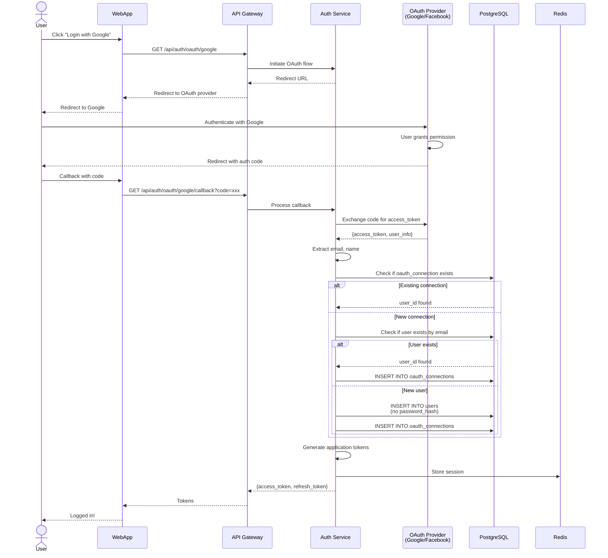
```mermaid
sequenceDiagram
    actor User
    participant WebApp
    participant Gateway as API Gateway
    participant Auth as Auth Service
    participant OAuth as OAuth Provider<br/>(Google/Facebook)
    participant DB as PostgreSQL
    
    User->>WebApp: Click "Login with Google"
    WebApp->>Gateway: GET /api/auth/oauth/google
    Gateway->>Auth: Initiate OAuth flow
    Auth-->>Gateway: Redirect URL
    Gateway-->>WebApp: Redirect to OAuth provider
    WebApp-->>User: Redirect to Google
    
    User->>OAuth: Authenticate with Google
    OAuth->>OAuth: User grants permission
    OAuth-->>User: Redirect with auth code
    User->>WebApp: Callback with code
    WebApp->>Gateway: GET /api/auth/oauth/google/callback?code=xxx
    Gateway->>Auth: Process callback
    
    Auth->>OAuth: Exchange code for access_token
    OAuth-->>Auth: {access_token, user_info}
    Auth->>Auth: Extract email, name
    
    Auth->>DB: Check if oauth_connection exists
    
    alt Existing connection
        DB-->>Auth: user_id found
    else New connection
        Auth->>DB: Check if user exists by email
        alt User exists
            DB-->>Auth: user_id found
            Auth->>DB: INSERT INTO oauth_connections
        else New user
            Auth->>DB: INSERT INTO users<br/>(no password_hash)
            Auth->>DB: INSERT INTO oauth_connections
        end
    end
    
    Auth->>Auth: Generate application tokens
    Auth->>Redis: Store session
    Auth-->>Gateway: {access_token, refresh_token}
    Gateway-->>WebApp: Tokens
    WebApp-->>User: Logged in!
```

---

## Async Job Processing

### Job Submission and Processing Flow

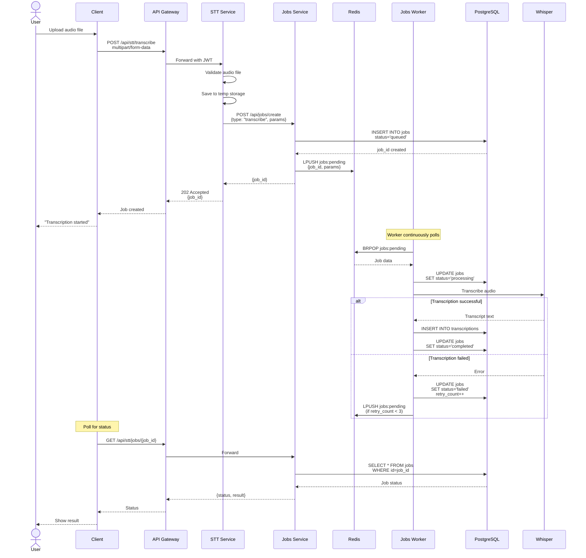
```mermaid
sequenceDiagram
    actor User
    participant Client
    participant Gateway as API Gateway
    participant STT as STT Service
    participant Jobs as Jobs Service
    participant Redis
    participant Worker as Jobs Worker
    participant DB as PostgreSQL
    participant Whisper
    
    User->>Client: Upload audio file
    Client->>Gateway: POST /api/stt/transcribe<br/>multipart/form-data
    Gateway->>STT: Forward with JWT
    
    STT->>STT: Validate audio file
    STT->>STT: Save to temp storage
    
    STT->>Jobs: POST /api/jobs/create<br/>{type: "transcribe", params}
    Jobs->>DB: INSERT INTO jobs<br/>status='queued'
    DB-->>Jobs: job_id created
    Jobs->>Redis: LPUSH jobs:pending<br/>{job_id, params}
    Jobs-->>STT: {job_id}
    
    STT-->>Gateway: 202 Accepted<br/>{job_id}
    Gateway-->>Client: Job created
    Client-->>User: "Transcription started"
    
    Note over Worker: Worker continuously polls
    Worker->>Redis: BRPOP jobs:pending
    Redis-->>Worker: Job data
    
    Worker->>DB: UPDATE jobs<br/>SET status='processing'
    Worker->>Whisper: Transcribe audio
    
    alt Transcription successful
        Whisper-->>Worker: Transcript text
        Worker->>DB: INSERT INTO transcriptions
        Worker->>DB: UPDATE jobs<br/>SET status='completed'
    else Transcription failed
        Whisper-->>Worker: Error
        Worker->>DB: UPDATE jobs<br/>SET status='failed'<br/>retry_count++
        Worker->>Redis: LPUSH jobs:pending<br/>(if retry_count < 3)
    end
    
    Note over Client: Poll for status
    Client->>Gateway: GET /api/stt/jobs/{job_id}
    Gateway->>Jobs: Forward
    Jobs->>DB: SELECT * FROM jobs<br/>WHERE id=job_id
    DB-->>Jobs: Job status
    Jobs-->>Gateway: {status, result}
    Gateway-->>Client: Status
    Client-->>User: Show result
```

### Job Status State Machine

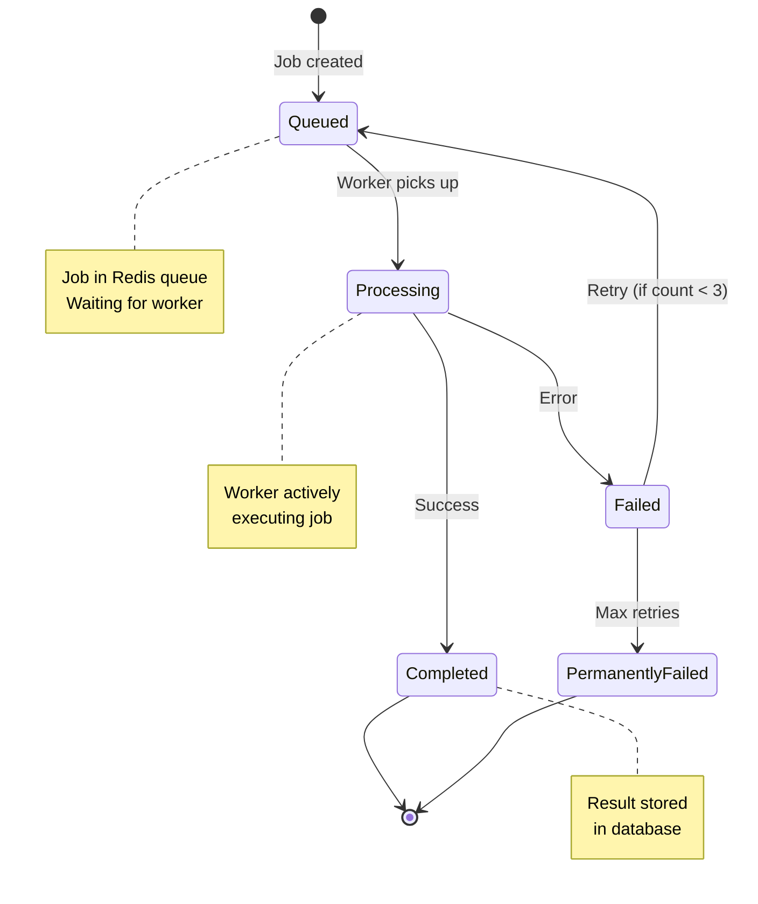
```mermaid
stateDiagram-v2
    [*] --> Queued: Job created
    Queued --> Processing: Worker picks up
    Processing --> Completed: Success
    Processing --> Failed: Error
    Failed --> Queued: Retry (if count < 3)
    Failed --> PermanentlyFailed: Max retries
    Completed --> [*]
    PermanentlyFailed --> [*]
    
    note right of Queued
        Job in Redis queue
        Waiting for worker
    end note
    
    note right of Processing
        Worker actively
        executing job
    end note
    
    note right of Completed
        Result stored
        in database
    end note
```

---

## Service Communication

### Synchronous API Call Pattern

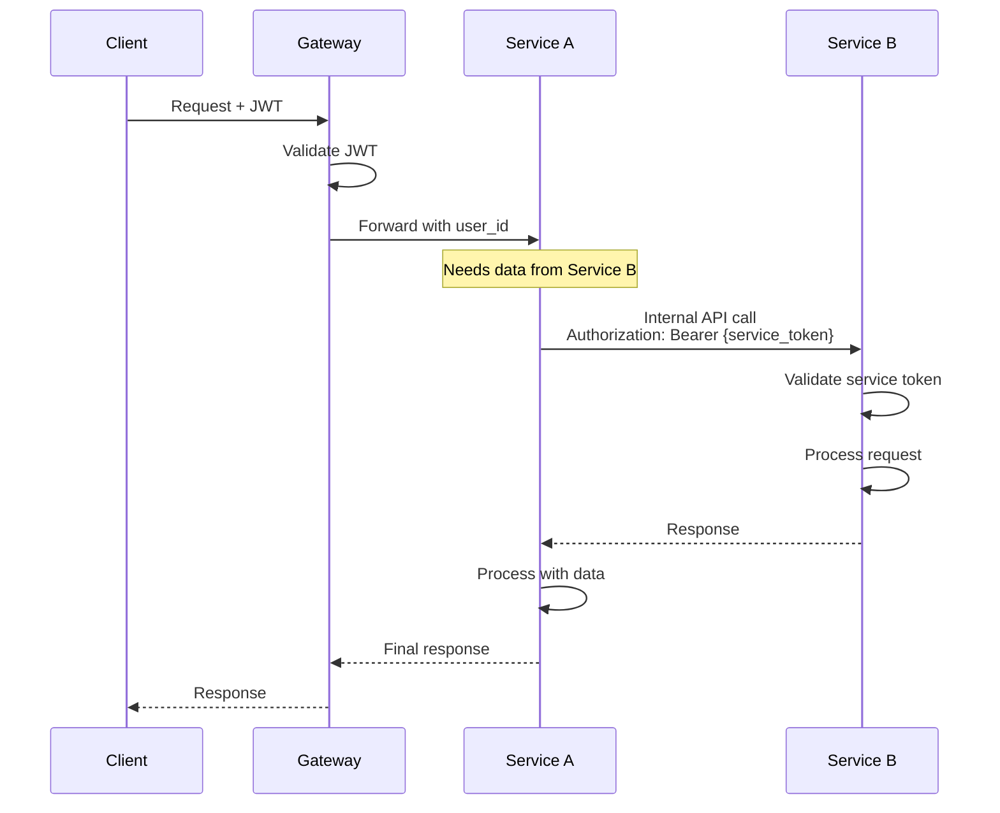
```mermaid
sequenceDiagram
    participant Client
    participant Gateway
    participant ServiceA as Service A
    participant ServiceB as Service B
    
    Client->>Gateway: Request + JWT
    Gateway->>Gateway: Validate JWT
    Gateway->>ServiceA: Forward with user_id
    
    Note over ServiceA: Needs data from Service B
    
    ServiceA->>ServiceB: Internal API call<br/>Authorization: Bearer {service_token}
    ServiceB->>ServiceB: Validate service token
    ServiceB->>ServiceB: Process request
    ServiceB-->>ServiceA: Response
    
    ServiceA->>ServiceA: Process with data
    ServiceA-->>Gateway: Final response
    Gateway-->>Client: Response
```

### Circuit Breaker Pattern

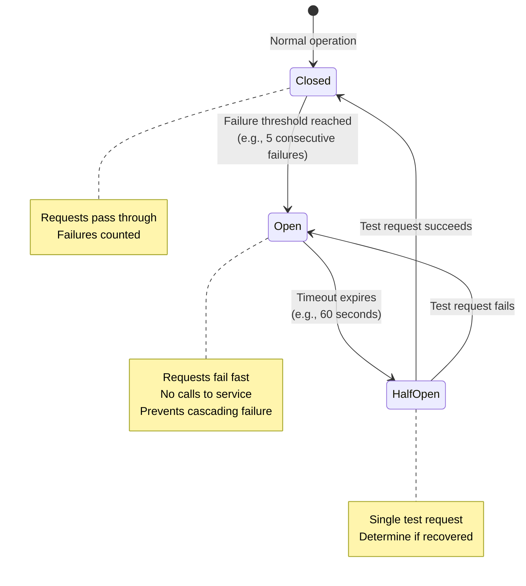
```mermaid
stateDiagram-v2
    [*] --> Closed: Normal operation
    Closed --> Open: Failure threshold reached<br/>(e.g., 5 consecutive failures)
    Open --> HalfOpen: Timeout expires<br/>(e.g., 60 seconds)
    HalfOpen --> Closed: Test request succeeds
    HalfOpen --> Open: Test request fails
    
    note right of Closed
        Requests pass through
        Failures counted
    end note
    
    note right of Open
        Requests fail fast
        No calls to service
        Prevents cascading failure
    end note
    
    note right of HalfOpen
        Single test request
        Determine if recovered
    end note
```

---

## Data Flow

### Study Material to AI Response Flow

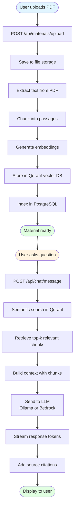
```mermaid
flowchart TD
    Start([User uploads PDF]) --> Upload[POST /api/materials/upload]
    Upload --> Save[Save to file storage]
    Save --> Extract[Extract text from PDF]
    Extract --> Chunk[Chunk into passages]
    Chunk --> Embed[Generate embeddings]
    Embed --> Store[Store in Qdrant vector DB]
    Store --> Index[Index in PostgreSQL]
    Index --> Ready([Material ready])
    
    Ready -.-> Query([User asks question])
    Query --> Chat[POST /api/chat/message]
    Chat --> Search[Semantic search in Qdrant]
    Search --> Retrieve[Retrieve top-k relevant chunks]
    Retrieve --> Context[Build context with chunks]
    Context --> LLM[Send to LLM<br/>Ollama or Bedrock]
    LLM --> Stream[Stream response tokens]
    Stream --> Cite[Add source citations]
    Cite --> Response([Display to user])
    
    style Start fill:#e1f5ff
    style Ready fill:#e1ffe1
    style Query fill:#fff4e1
    style Response fill:#e1ffe1
```

### Audio Transcription Complete Flow

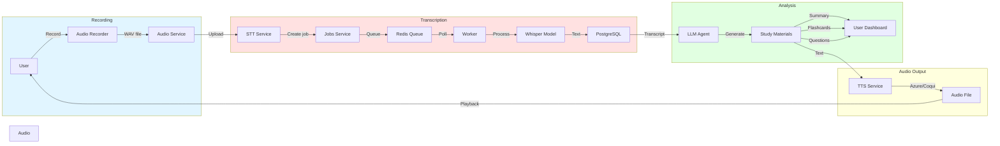
```mermaid
flowchart LR
    subgraph Recording
        A[User] -->|Record| B[Audio Recorder]
        B -->|WAV file| C[Audio Service]
    end
    
    subgraph Transcription
        C -->|Upload| D[STT Service]
        D -->|Create job| E[Jobs Service]
        E -->|Queue| F[Redis Queue]
        F -->|Poll| G[Worker]
        G -->|Process| H[Whisper Model]
        H -->|Text| I[PostgreSQL]
    end
    
    subgraph Analysis
        I -->|Transcript| J[LLM Agent]
        J -->|Generate| K[Study Materials]
        K -->|Summary| L[User Dashboard]
        K -->|Flashcards| L
        K -->|Questions| L
    end
    
    subgraph Audio Output
        K -->|Text| M[TTS Service]
        M -->|Azure/Coqui| N[Audio File]
        N -->|Playback| A
    end
    
    style Recording fill:#e1f5ff
    style Transcription fill:#ffe1e1
    style Analysis fill:#e1ffe1
    style Audio Output fill:#fff4e1
```

---

## Deployment Diagrams

### Local Development Deployment

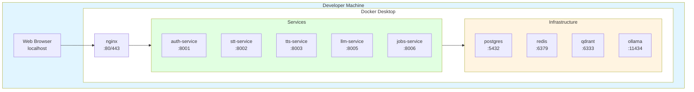
```mermaid
graph TB
    subgraph DevMachine["Developer Machine"]
        subgraph Docker["Docker Desktop"]
            Gateway["nginx<br/>:80/443"]
            
            subgraph Services["Services"]
                Auth["auth-service<br/>:8001"]
                STT["stt-service<br/>:8002"]
                TTS["tts-service<br/>:8003"]
                LLM["llm-service<br/>:8005"]
                Jobs["jobs-service<br/>:8006"]
            end
            
            subgraph Infra["Infrastructure"]
                PG["postgres<br/>:5432"]
                RD["redis<br/>:6379"]
                QD["qdrant<br/>:6333"]
                OL["ollama<br/>:11434"]
            end
            
            Gateway --> Services
            Services --> Infra
        end
        
        Browser["Web Browser<br/>localhost"] --> Gateway
    end
    
    style DevMachine fill:#e1f5ff
    style Docker fill:#fff
    style Services fill:#e1ffe1
    style Infra fill:#fff4e1
```

### Migration: Local → Bigger Server

```mermaid
flowchart LR
    subgraph Local["Local Dev Machine"]
        L1[Docker Compose]
        L2[Export Images]
        L3[docker save]
    end
    
    L1 --> L2 --> L3
    
    L3 -->|Transfer<br/>scp/USB| T1
    
    subgraph Transfer["File Transfer"]
        T1[lm-images.tar.gz<br/>~5-10 GB]
    end
    
    T1 -->|Copy to| S1
    
    subgraph Server["Bigger Local Server<br/>64GB RAM, 16+ cores"]
        S1[docker load]
        S2[Same docker-compose.yml]
        S3[docker-compose up -d]
        S4[Services Running]
    end
    
    S1 --> S2 --> S3 --> S4
    
    style Local fill:#e1f5ff
    style Transfer fill:#fff4e1
    style Server fill:#e1ffe1
    
    Note1[No code changes!<br/>Same containers<br/>Better performance]
    S4 -.-> Note1
```

### Future: AWS Cloud Deployment

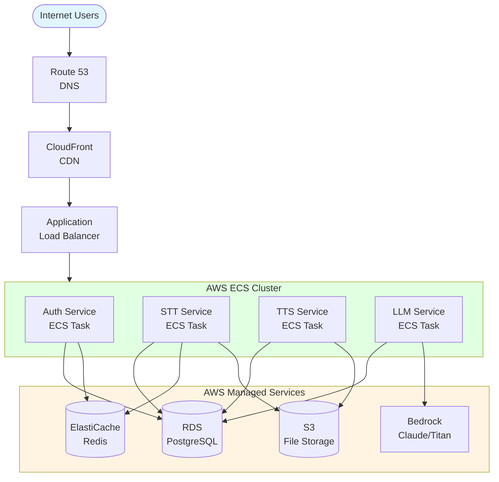
```mermaid
graph TB
    Internet([Internet Users])
    
    Internet --> R53[Route 53<br/>DNS]
    R53 --> CF[CloudFront<br/>CDN]
    CF --> ALB[Application<br/>Load Balancer]
    
    ALB --> ECS
    
    subgraph ECS["AWS ECS Cluster"]
        direction TB
        AuthTask["Auth Service<br/>ECS Task"]
        STTTask["STT Service<br/>ECS Task"]
        TTSTask["TTS Service<br/>ECS Task"]
        LLMTask["LLM Service<br/>ECS Task"]
    end
    
    subgraph Managed["AWS Managed Services"]
        RDS[("RDS<br/>PostgreSQL")]
        ElastiCache[("ElastiCache<br/>Redis")]
        S3[("S3<br/>File Storage")]
        Bedrock["Bedrock<br/>Claude/Titan"]
    end
    
    AuthTask & STTTask & TTSTask & LLMTask --> RDS
    AuthTask & STTTask --> ElastiCache
    STTTask & TTSTask --> S3
    LLMTask --> Bedrock
    
    style Internet fill:#e1f5ff
    style ECS fill:#e1ffe1
    style Managed fill:#fff4e1
```

---

## Service Communication

### Inter-Service Call with Circuit Breaker

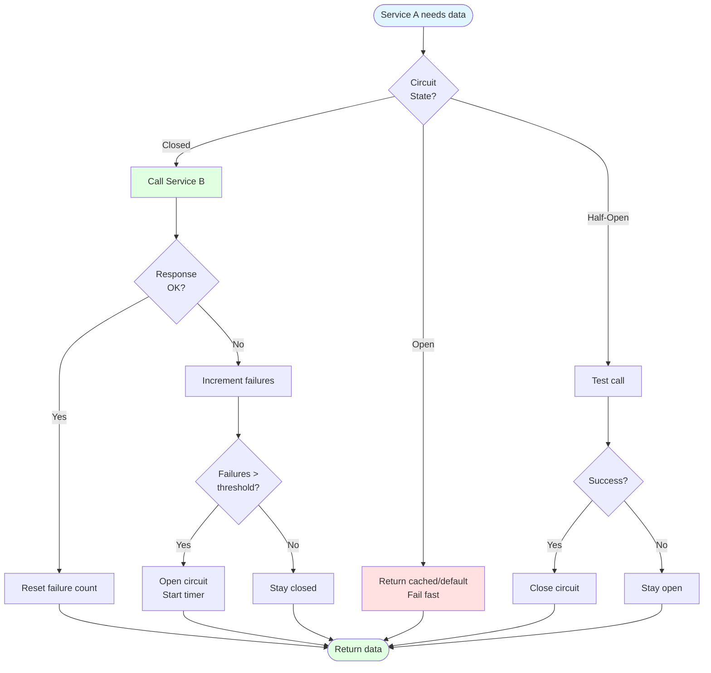
```mermaid
flowchart TD
    Start([Service A needs data]) --> Check{Circuit<br/>State?}
    
    Check -->|Closed| Call[Call Service B]
    Check -->|Open| Fail[Return cached/default<br/>Fail fast]
    Check -->|Half-Open| Test[Test call]
    
    Call --> Success{Response<br/>OK?}
    Success -->|Yes| Reset[Reset failure count]
    Success -->|No| Inc[Increment failures]
    
    Inc --> Threshold{Failures ><br/>threshold?}
    Threshold -->|Yes| Open[Open circuit<br/>Start timer]
    Threshold -->|No| Closed[Stay closed]
    
    Test --> TestOK{Success?}
    TestOK -->|Yes| Close[Close circuit]
    TestOK -->|No| StayOpen[Stay open]
    
    Reset --> End([Return data])
    Fail --> End
    Close --> End
    Open --> End
    Closed --> End
    StayOpen --> End
    
    style Start fill:#e1f5ff
    style Call fill:#e1ffe1
    style Fail fill:#ffe1e1
    style End fill:#e1ffe1
```

### Retry Pattern with Exponential Backoff

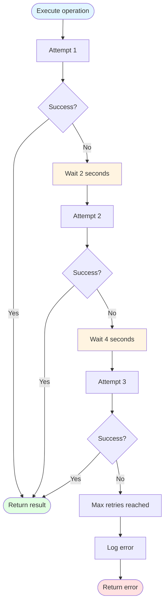
```mermaid
flowchart TD
    Start([Execute operation]) --> Try1[Attempt 1]
    Try1 --> Check1{Success?}
    Check1 -->|Yes| Success([Return result])
    Check1 -->|No| Wait1[Wait 2 seconds]
    
    Wait1 --> Try2[Attempt 2]
    Try2 --> Check2{Success?}
    Check2 -->|Yes| Success
    Check2 -->|No| Wait2[Wait 4 seconds]
    
    Wait2 --> Try3[Attempt 3]
    Try3 --> Check3{Success?}
    Check3 -->|Yes| Success
    Check3 -->|No| MaxRetries[Max retries reached]
    
    MaxRetries --> Log[Log error]
    Log --> Fail([Return error])
    
    style Start fill:#e1f5ff
    style Success fill:#e1ffe1
    style Fail fill:#ffe1e1
    style Wait1 fill:#fff4e1
    style Wait2 fill:#fff4e1
```

---

## Data Flow

### Database Schema Relationships

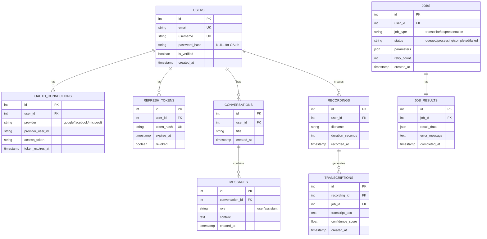
```mermaid
erDiagram
    USERS ||--o{ OAUTH_CONNECTIONS : has
    USERS ||--o{ REFRESH_TOKENS : has
    USERS ||--o{ CONVERSATIONS : has
    USERS ||--o{ RECORDINGS : creates
    
    USERS {
        int id PK
        string email UK
        string username UK
        string password_hash "NULL for OAuth"
        boolean is_verified
        timestamp created_at
    }
    
    OAUTH_CONNECTIONS {
        int id PK
        int user_id FK
        string provider "google/facebook/microsoft"
        string provider_user_id
        string access_token
        timestamp token_expires_at
    }
    
    REFRESH_TOKENS {
        int id PK
        int user_id FK
        string token_hash UK
        timestamp expires_at
        boolean revoked
    }
    
    CONVERSATIONS ||--o{ MESSAGES : contains
    
    CONVERSATIONS {
        int id PK
        int user_id FK
        string title
        timestamp created_at
    }
    
    MESSAGES {
        int id PK
        int conversation_id FK
        string role "user/assistant"
        text content
        timestamp created_at
    }
    
    JOBS ||--|| JOB_RESULTS : has
    
    JOBS {
        int id PK
        int user_id FK
        string job_type "transcribe/tts/presentation"
        string status "queued/processing/completed/failed"
        json parameters
        int retry_count
        timestamp created_at
    }
    
    JOB_RESULTS {
        int id PK
        int job_id FK
        json result_data
        text error_message
        timestamp completed_at
    }
    
    RECORDINGS ||--o{ TRANSCRIPTIONS : generates
    
    RECORDINGS {
        int id PK
        int user_id FK
        string filename
        int duration_seconds
        timestamp recorded_at
    }
    
    TRANSCRIPTIONS {
        int id PK
        int recording_id FK
        int job_id FK
        text transcript_text
        float confidence_score
        timestamp created_at
    }
```

### Redis Data Structures

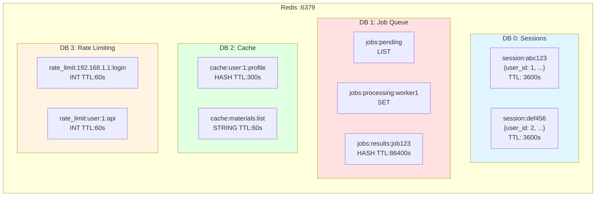
```mermaid
graph LR
    subgraph Redis["Redis :6379"]
        subgraph DB0["DB 0: Sessions"]
            S1["session:abc123<br/>{user_id: 1, ...}<br/>TTL: 3600s"]
            S2["session:def456<br/>{user_id: 2, ...}<br/>TTL: 3600s"]
        end
        
        subgraph DB1["DB 1: Job Queue"]
            Q1["jobs:pending<br/>LIST"]
            Q2["jobs:processing:worker1<br/>SET"]
            Q3["jobs:results:job123<br/>HASH TTL:86400s"]
        end
        
        subgraph DB2["DB 2: Cache"]
            C1["cache:user:1:profile<br/>HASH TTL:300s"]
            C2["cache:materials:list<br/>STRING TTL:60s"]
        end
        
        subgraph DB3["DB 3: Rate Limiting"]
            R1["rate_limit:192.168.1.1:login<br/>INT TTL:60s"]
            R2["rate_limit:user:1:api<br/>INT TTL:60s"]
        end
    end
    
    style DB0 fill:#e1f5ff
    style DB1 fill:#ffe1e1
    style DB2 fill:#e1ffe1
    style DB3 fill:#fff4e1
```

---

## Deployment Diagrams

### Container Dependency Graph

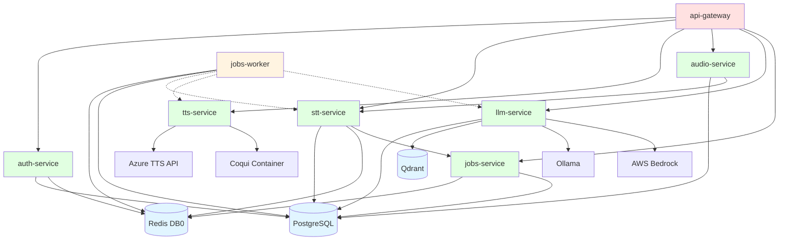
```mermaid
graph TD
    Gateway[api-gateway] --> Auth[auth-service]
    Gateway --> STT[stt-service]
    Gateway --> TTS[tts-service]
    Gateway --> Audio[audio-service]
    Gateway --> LLM[llm-service]
    Gateway --> Jobs[jobs-service]
    
    Auth --> PG[(PostgreSQL)]
    Auth --> RD[(Redis DB0)]
    
    STT --> PG
    STT --> RD
    STT --> Jobs
    
    TTS --> Azure[Azure TTS API]
    TTS --> Coqui[Coqui Container]
    
    Audio --> PG
    Audio --> STT
    
    LLM --> PG
    LLM --> QD[(Qdrant)]
    LLM --> Ollama[Ollama]
    LLM --> Bedrock[AWS Bedrock]
    
    Jobs --> RD
    Jobs --> PG
    
    Worker[jobs-worker] --> RD
    Worker --> PG
    Worker -.-> STT
    Worker -.-> TTS
    Worker -.-> LLM
    
    style Gateway fill:#ffe1e1
    style Auth fill:#e1ffe1
    style STT fill:#e1ffe1
    style TTS fill:#e1ffe1
    style Audio fill:#e1ffe1
    style LLM fill:#e1ffe1
    style Jobs fill:#e1ffe1
    style Worker fill:#fff4e1
    style PG fill:#e1f5ff
    style RD fill:#e1f5ff
    style QD fill:#e1f5ff
```

### Service Startup Order

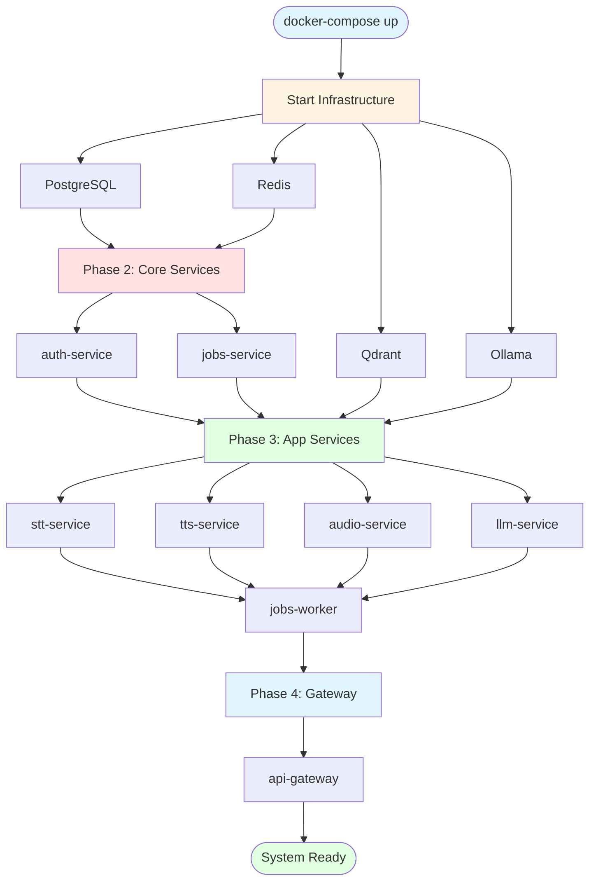
```mermaid
graph TD
    Start([docker-compose up]) --> Infra[Start Infrastructure]
    
    Infra --> PG[PostgreSQL]
    Infra --> Redis[Redis]
    Infra --> Qdrant[Qdrant]
    Infra --> Ollama[Ollama]
    
    PG & Redis --> Phase2[Phase 2: Core Services]
    
    Phase2 --> Auth[auth-service]
    Phase2 --> Jobs[jobs-service]
    
    Auth & Jobs & Qdrant & Ollama --> Phase3[Phase 3: App Services]
    
    Phase3 --> STT[stt-service]
    Phase3 --> TTS[tts-service]
    Phase3 --> Audio[audio-service]
    Phase3 --> LLM[llm-service]
    
    STT & TTS & Audio & LLM --> Worker[jobs-worker]
    
    Worker --> Phase4[Phase 4: Gateway]
    
    Phase4 --> Gateway[api-gateway]
    
    Gateway --> Ready([System Ready])
    
    style Start fill:#e1f5ff
    style Infra fill:#fff4e1
    style Phase2 fill:#ffe1e1
    style Phase3 fill:#e1ffe1
    style Phase4 fill:#e1f5ff
    style Ready fill:#e1ffe1
```

---

## Scaling Diagrams

### Horizontal Scaling Example

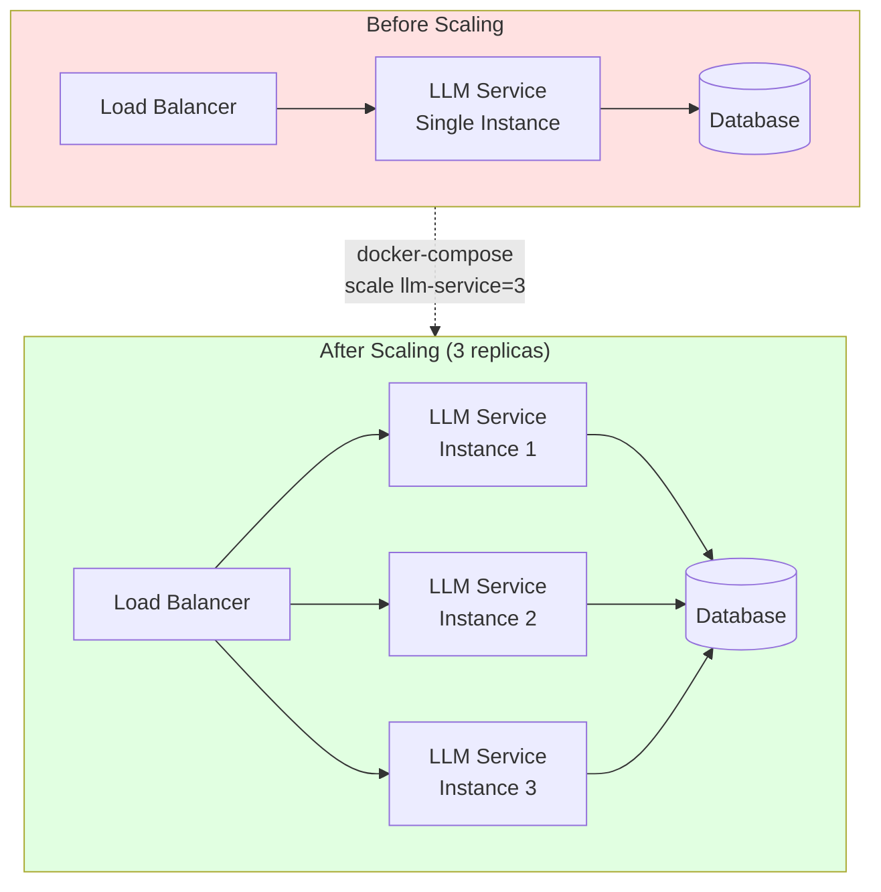
```mermaid
graph TB
    subgraph Before["Before Scaling"]
        LB1[Load Balancer] --> S1[LLM Service<br/>Single Instance]
        S1 --> DB1[(Database)]
    end
    
    subgraph After["After Scaling (3 replicas)"]
        LB2[Load Balancer] --> S2A[LLM Service<br/>Instance 1]
        LB2 --> S2B[LLM Service<br/>Instance 2]
        LB2 --> S2C[LLM Service<br/>Instance 3]
        S2A & S2B & S2C --> DB2[(Database)]
    end
    
    Before -.->|docker-compose<br/>scale llm-service=3| After
    
    style Before fill:#ffe1e1
    style After fill:#e1ffe1
```

### Read Replica Pattern (Future)

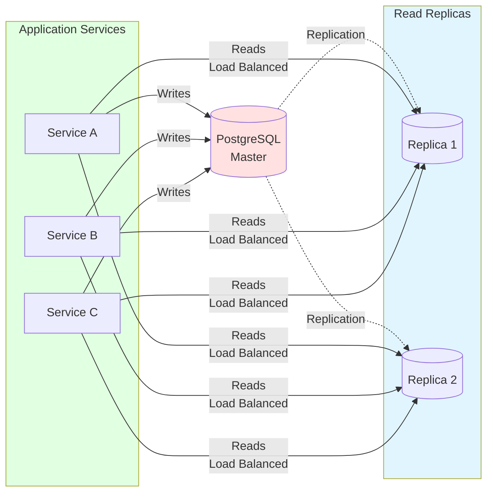
```mermaid
graph LR
    subgraph Services["Application Services"]
        S1[Service A]
        S2[Service B]
        S3[Service C]
    end
    
    S1 & S2 & S3 -->|Writes| Master[(PostgreSQL<br/>Master)]
    
    Master -.->|Replication| R1
    Master -.->|Replication| R2
    
    subgraph Replicas["Read Replicas"]
        R1[(Replica 1)]
        R2[(Replica 2)]
    end
    
    S1 & S2 & S3 -->|Reads<br/>Load Balanced| R1 & R2
    
    style Services fill:#e1ffe1
    style Master fill:#ffe1e1
    style Replicas fill:#e1f5ff
```

---

## Monitoring & Observability

### Distributed Tracing Flow

```mermaid
sequenceDiagram
    participant Client
    participant Gateway
    participant Auth
    participant LLM
    participant Qdrant
    
    Note over Client: trace_id: ABC123
    Client->>Gateway: Request<br/>span_id: 1
    Note over Gateway: Adds trace headers
    
    Gateway->>Auth: Verify token<br/>span_id: 2, parent: 1<br/>trace_id: ABC123
    Auth->>Auth: Check DB
    Auth-->>Gateway: Valid
    
    Gateway->>LLM: Forward request<br/>span_id: 3, parent: 1<br/>trace_id: ABC123
    LLM->>Qdrant: Vector search<br/>span_id: 4, parent: 3<br/>trace_id: ABC123
    Qdrant-->>LLM: Results
    LLM-->>Gateway: Response
    
    Gateway-->>Client: Final response
    
    Note over Client,Qdrant: All operations linked by trace_id ABC123<br/>Enables end-to-end request tracing
```

### Logging Aggregation

```mermaid
flowchart LR
    subgraph Services["Services"]
        S1[Auth] --> L1[Logs]
        S2[STT] --> L2[Logs]
        S3[TTS] --> L3[Logs]
        S4[LLM] --> L4[Logs]
    end
    
    L1 & L2 & L3 & L4 --> Aggregator[Log Aggregator<br/>Fluentd/Logstash]
    
    Aggregator --> Storage[Log Storage<br/>Elasticsearch]
    
    Storage --> Kibana[Kibana<br/>Visualization]
    Storage --> Alerts[Alert Manager]
    
    Kibana --> Dashboard[Monitoring<br/>Dashboard]
    Alerts --> Notification[PagerDuty/<br/>Slack]
    
    style Services fill:#e1ffe1
    style Aggregator fill:#fff4e1
    style Storage fill:#e1f5ff
    style Dashboard fill:#e1ffe1
```

---

## Security Architecture

### JWT Token Flow

```mermaid
sequenceDiagram
    participant User
    participant Auth as Auth Service
    participant Redis
    participant Service as Any Service
    
    Note over User,Redis: Login generates tokens
    User->>Auth: Login (email/password)
    Auth->>Auth: Validate credentials
    Auth->>Auth: Generate tokens
    Note over Auth: access_token: 30min expiry<br/>refresh_token: 7 days expiry
    Auth->>Redis: Store session
    Auth-->>User: Return tokens
    
    Note over User,Service: Use access token
    User->>Service: API Request<br/>Authorization: Bearer {access_token}
    Service->>Service: Verify JWT signature
    Service->>Service: Check expiration
    Service-->>User: Response
    
    Note over User,Auth: Token expired, refresh
    User->>Auth: POST /refresh<br/>{refresh_token}
    Auth->>Auth: Verify refresh token
    Auth->>Redis: Check not revoked
    Auth->>Auth: Generate new access_token
    Auth-->>User: {new_access_token}
```

### OAuth2 Authorization Code Flow

```mermaid
sequenceDiagram
    actor User
    participant App as Client App
    participant Auth as Auth Service
    participant OAuth as OAuth Provider
    
    User->>App: Click "Login with Google"
    App->>Auth: Initiate OAuth
    Auth->>Auth: Generate state (CSRF token)
    Auth-->>App: Redirect URL
    App-->>User: Redirect to OAuth provider
    
    User->>OAuth: Authenticate
    OAuth->>OAuth: User grants permissions
    OAuth-->>User: Redirect with code & state
    
    User->>App: Callback with code
    App->>Auth: Send code & state
    Auth->>Auth: Verify state matches
    Auth->>OAuth: Exchange code for token<br/>(client_id, client_secret, code)
    OAuth-->>Auth: {access_token, id_token}
    
    Auth->>OAuth: Get user profile
    OAuth-->>Auth: {email, name, picture}
    
    Auth->>Auth: Create/link user account
    Auth->>Auth: Generate app tokens
    Auth-->>App: {access_token, refresh_token}
    App-->>User: Logged in!
```

---

## Complete User Journey

### New User Registration to First Chat

```mermaid
flowchart TD
    Start([New User]) --> Register[Register account]
    Register --> Verify[Verify email]
    Verify --> Login[Login]
    Login --> Dashboard[View dashboard]
    Dashboard --> Upload[Upload study material PDF]
    Upload --> Process[System processes PDF]
    Process --> Embed[Generate embeddings]
    Embed --> Ready[Material ready]
    Ready --> Ask[Ask AI tutor question]
    Ask --> Search[Semantic search]
    Search --> Context[Build context]
    Context --> Generate[LLM generates answer]
    Generate --> Cite[Add citations]
    Cite --> Display[Display to user]
    Display --> Listen{Want audio?}
    Listen -->|Yes| TTS[Generate TTS]
    Listen -->|No| End([Done])
    TTS --> Play[Play audio]
    Play --> End
    
    style Start fill:#e1f5ff
    style Register fill:#fff4e1
    style Login fill:#fff4e1
    style Dashboard fill:#e1ffe1
    style Ask fill:#ffe1e1
    style Display fill:#e1ffe1
    style End fill:#e1ffe1
```

---

## Appendix: Diagram Tools

### Mermaid Syntax Support

GitHub natively renders Mermaid diagrams
