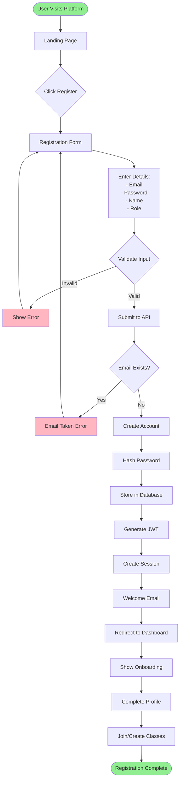
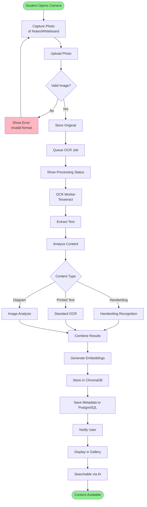
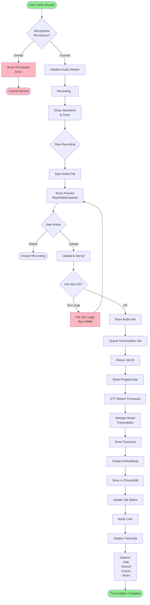
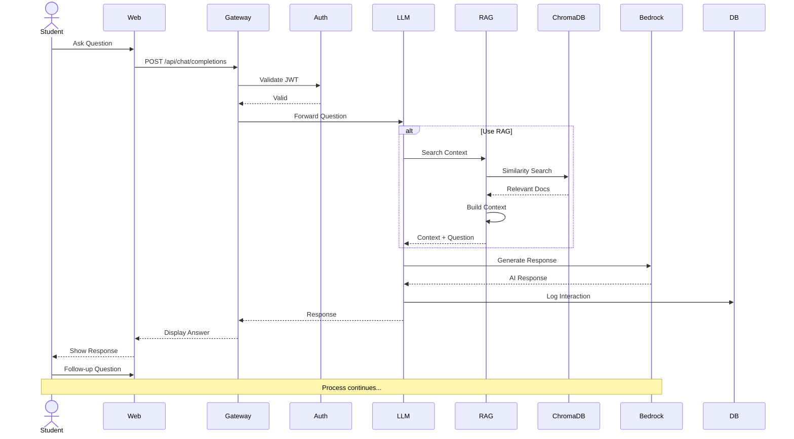
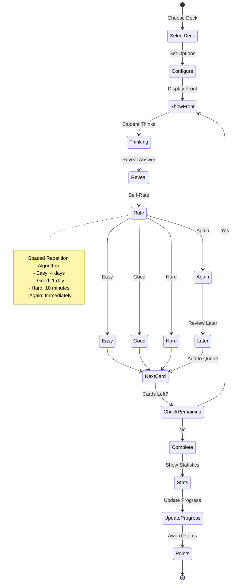
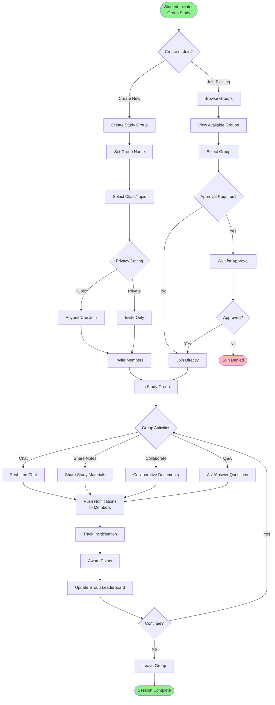
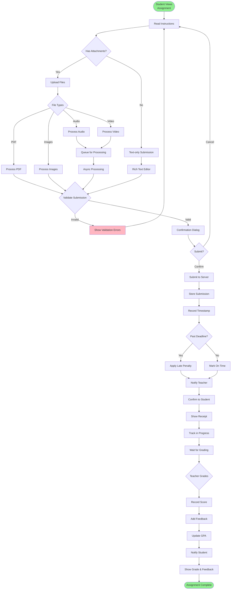

# Little Monster GPA - Business Process Flows
## Alpha 1.0 - User Journey Diagrams

**Version:** 1.0.0-alpha  
**Date:** November 4, 2025  
**Status:** Current  
**Source:** Consolidated from docs/alpha-0.9/BUSINESS-PROCESS-FLOWS.md

---

## Table of Contents
1. [User Registration & Onboarding](#user-registration--onboarding)
2. [Content Capture Workflows](#content-capture-workflows)
3. [Study Session Workflows](#study-session-workflows)
4. [Social Collaboration Flows](#social-collaboration-flows)
5. [Assessment & Grading Flows](#assessment--grading-flows)

---

## User Registration & Onboarding

### New User Registration Flow

---

## Content Capture Workflows

### Photo Capture & OCR Processing

### Audio Recording & Transcription Flow

---

## Study Session Workflows

### AI Chat Study Session

### Flashcard Study Flow

---

## Social Collaboration Flows

### Group Study Session Flow

---

## Assessment & Grading Flows

### Assignment Submission Flow

---

## Reference

All diagrams are maintained in Git with version control. For additional system architecture diagrams, see:
- ARCHITECTURE-DIAGRAMS.md (technical architecture diagrams)
- TECHNICAL-ARCHITECTURE.md (system architecture documentation)
