# Business Process Flow Diagrams
## Alpha 0.9 - User Journeys & System Workflows

**Version:** 0.9.0-alpha  
**Date:** November 2, 2025  

---

## Table of Contents
1. [User Registration & Onboarding](#user-registration--onboarding)
2. [Content Capture Workflows](#content-capture-workflows)
3. [Study Session Workflows](#study-session-workflows)
4. [Social Collaboration Flows](#social-collaboration-flows)
5. [Assessment & Grading Flows](#assessment--grading-flows)

---

## User Registration & Onboarding

### New User Registration Flow

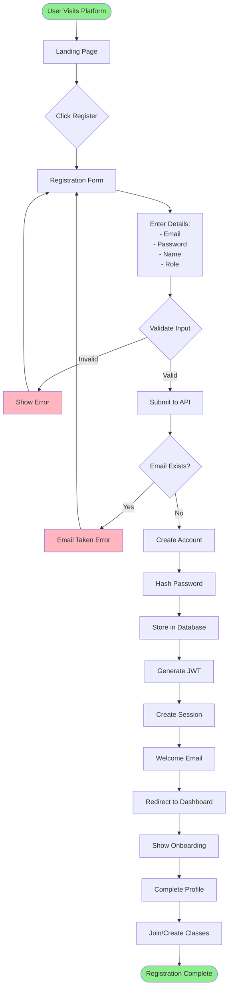

### Login Flow

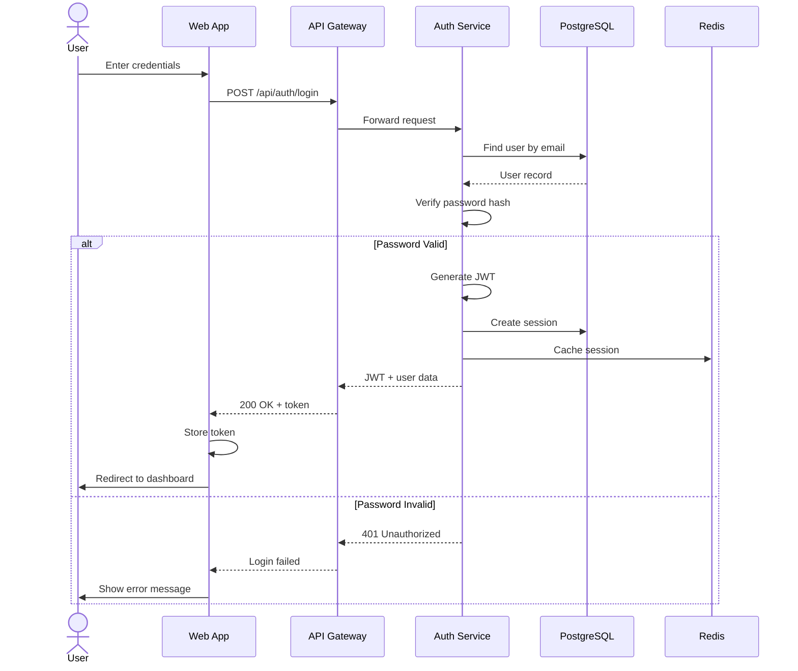

---

## Content Capture Workflows

### Photo Capture & OCR Processing

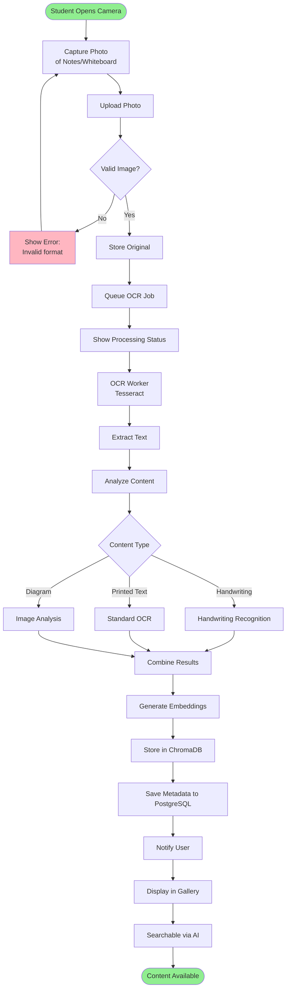

### Audio Recording & Transcription Flow

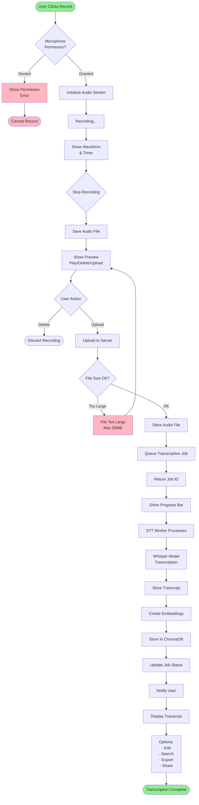

---

## Study Session Workflows

### AI Chat Study Session

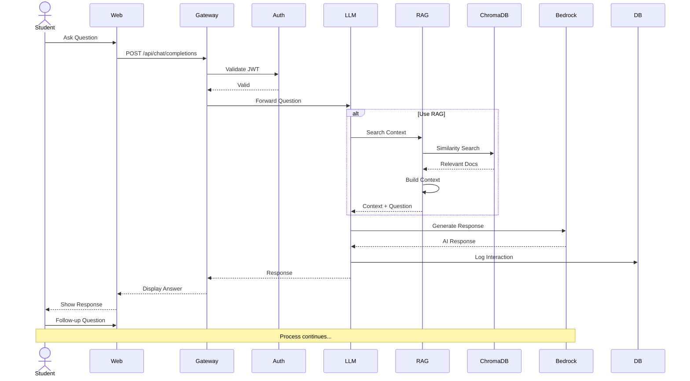

### Study Tools Generation Flow

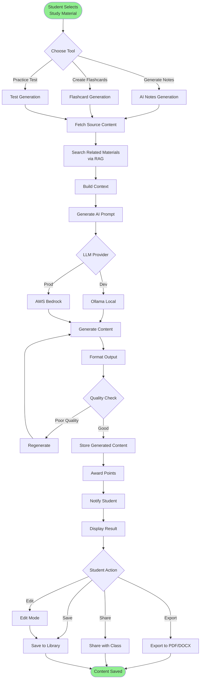

---

## Social Collaboration Flows

### Group Study Session Flow

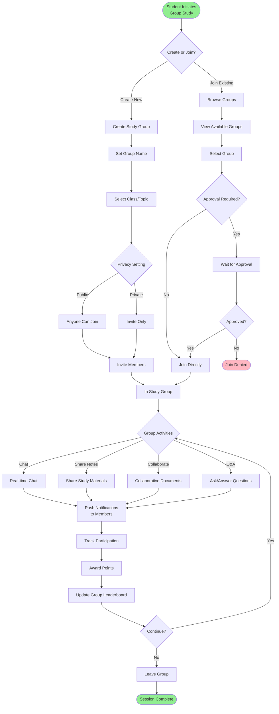

### Content Sharing Workflow

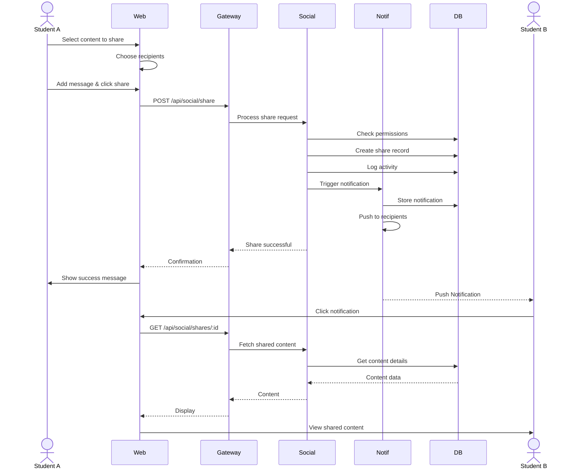

---

## Assessment & Grading Flows

### Assignment Submission Flow

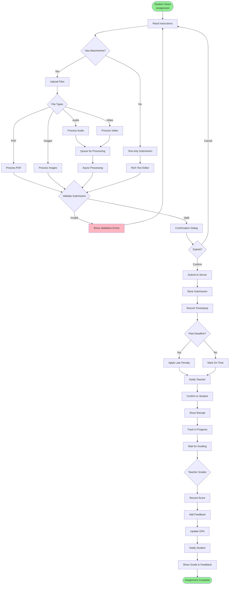

### AI-Assisted Grading Flow (Teacher Side)

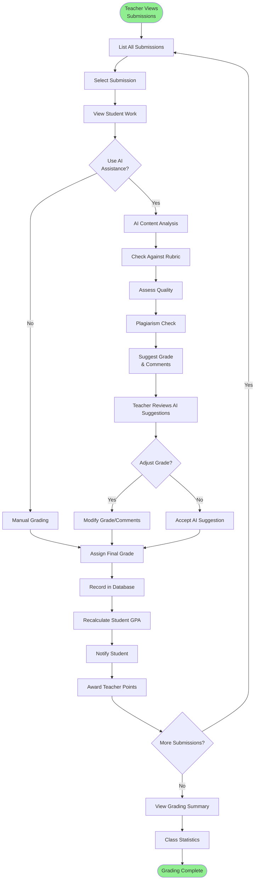

---

## Study Session Workflows

### Complete Study Session Flow

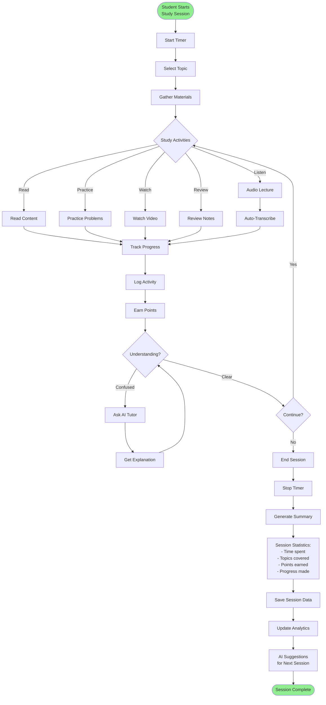

### Flashcard Study Flow

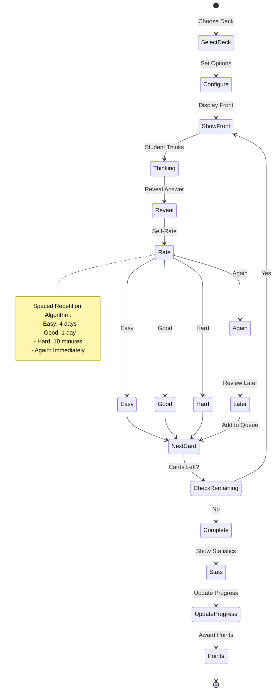

---

## Real-Time Collaboration Flows

### Live Chat in Study Group

```
Real-Time Chat Flow:

Student A                    Server                    Student B
    │                          │                          │
    │  1. Connect WebSocket    │                          │
    ├─────────────────────────▶│                          │
    │  ← Connected              │  2. Connect             │
    │                          │◀─────────────────────────┤
    │                          │  ← Connected             │
    │                          │                          │
    │  3. Type Message         │                          │
    ├─────────────────────────▶│                          │
    │                          │  4. Broadcast            │
    │                          ├─────────────────────────▶│
    │                          │                          │  5. Display
    │  6. Typing Indicator     │                          │
    ├────────────────────────
