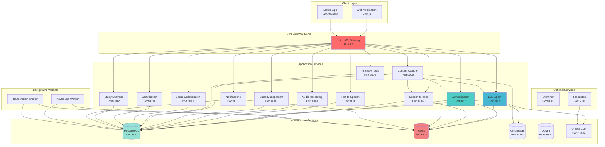
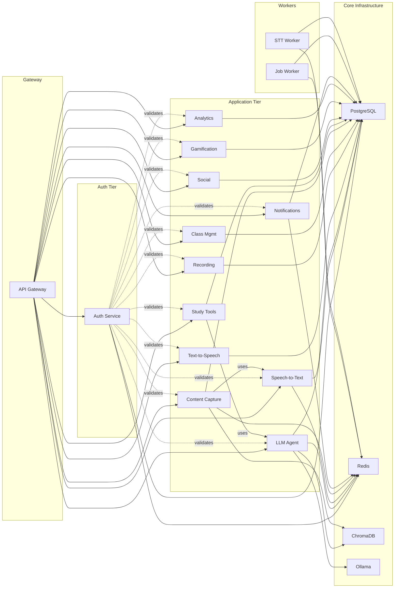
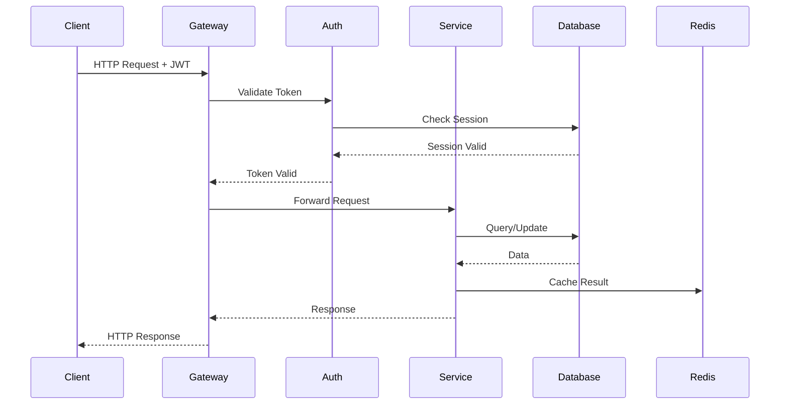
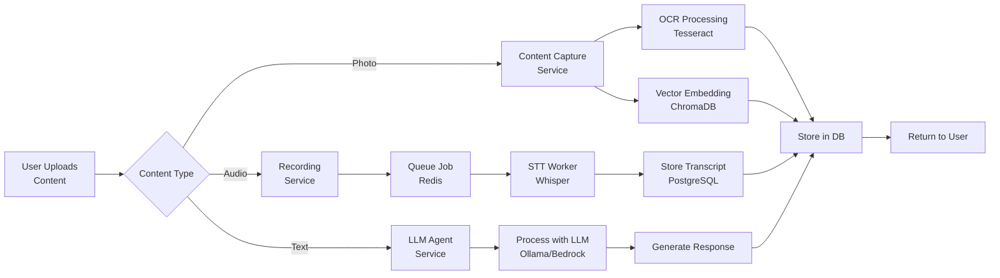

# Little Monster GPA System Architecture
## Alpha 0.9 - Complete Technical Documentation

**Version:** 0.9.0-alpha  
**Date:** November 2, 2025  
**Status:** Production Ready

---

## Table of Contents
1. [System Overview](#system-overview)
2. [Architecture Diagrams](#architecture-diagrams)
3. [Service Registry](#service-registry)
4. [Network Architecture](#network-architecture)
5. [Data Flow](#data-flow)
6. [Security Architecture](#security-architecture)

---

## System Overview

Little Monster is a microservices-based educational platform providing AI-powered study tools, social learning features, and content management capabilities.

### Technology Stack

```
┌─────────────────────────────────────────────────────────────┐
│                    TECHNOLOGY STACK                          │
├─────────────────────────────────────────────────────────────┤
│ Frontend:  Next.js 14, React 18, TypeScript, TailwindCSS   │
│ Backend:   Python 3.11, FastAPI, PostgreSQL 15             │
│ Cache:     Redis 7, ChromaDB, Qdrant                       │
│ AI/ML:     Ollama, AWS Bedrock, OpenAI Whisper            │
│ Infra:     Docker, Nginx, AWS (optional)                   │
└─────────────────────────────────────────────────────────────┘
```

### Design Principles

1. **Microservices Architecture** - Independent, scalable services
2. **API-First Design** - RESTful APIs with OpenAPI specs
3. **Cloud-Native** - Containerized, horizontally scalable
4. **Security by Design** - JWT auth, encrypted data, RBAC
5. **Async Processing** - Redis queues for heavy operations
6. **Observability** - Structured logging, health checks

---

## Architecture Diagrams

### High-Level System Architecture



### Service Communication Matrix

```
┌─────────────┬──────┬─────┬─────┬─────┬─────┬───────┬─────────┬───────┐
│ Service     │ Auth │ LLM │ STT │ TTS │ DB  │ Redis │ ChromaDB│ Ollama│
├─────────────┼──────┼─────┼─────┼─────┼─────┼───────┼─────────┼───────┤
│ Auth        │  -   │  ✗  │  ✗  │  ✗  │  ✓  │   ✓   │    ✗    │   ✗   │
│ LLM Agent   │  ✓   │  -  │  ✗  │  ✗  │  ✓  │   ✓   │    ✓    │   ✓   │
│ STT         │  ✓   │  ✗  │  -  │  ✗  │  ✓  │   ✓   │    ✗    │   ✗   │
│ TTS         │  ✓   │  ✗  │  ✗  │  -  │  ✓  │   ✗   │    ✗    │   ✗   │
│ Recording   │  ✓   │  ✗  │  ✓  │  ✗  │  ✓  │   ✗   │    ✗    │   ✗   │
│ Class Mgmt  │  ✓   │  ✗  │  ✗  │  ✗  │  ✓  │   ✗   │    ✗    │   ✗   │
│ Content Cap │  ✓   │  ✗  │  ✓  │  ✗  │  ✓  │   ✓   │    ✓    │   ✗   │
│ AI Study    │  ✓   │  ✓  │  ✗  │  ✗  │  ✓  │   ✗   │    ✗    │   ✗   │
│ Social      │  ✓   │  ✗  │  ✗  │  ✗  │  ✓  │   ✗   │    ✗    │   ✗   │
│ Gamification│  ✓   │  ✗  │  ✗  │  ✗  │  ✓  │   ✗   │    ✗    │   ✗   │
│ Analytics   │  ✓   │  ✗  │  ✗  │  ✗  │  ✓  │   ✗   │    ✗    │   ✗   │
│ Notification│  ✓   │  ✗  │  ✗  │  ✗  │  ✓  │   ✓   │    ✗    │   ✗   │
└─────────────┴──────┴─────┴─────┴─────┴─────┴───────┴─────────┴───────┘

Legend: ✓ = Direct dependency, ✗ = No dependency
```

---

## Service Registry

### Complete Port Allocation

| Service | Container Name | Internal Port | External Port | Protocol | Purpose |
|---------|---------------|---------------|---------------|----------|---------|
| **Infrastructure** |
| PostgreSQL | lm-postgres | 5432 | 5432 | TCP | Primary database |
| Redis | lm-redis | 6379 | 6379 | TCP | Cache & message queue |
| ChromaDB | lm-chroma | 8000 | 8000 | HTTP | Vector database (RAG) |
| Qdrant | lm-qdrant | 6333 | 6333 | HTTP | Vector database (alt) |
| Qdrant gRPC | lm-qdrant | 6334 | 6334 | gRPC | Qdrant gRPC API |
| Ollama | lm-ollama | 11434 | 11434 | HTTP | Local LLM |
| Adminer | lm-adminer | 8080 | 8080 | HTTP | DB management UI |
| **Application Services** |
| API Gateway | lm-gateway | 80 | 80 | HTTP | Reverse proxy |
| Authentication | lm-auth | 8000 | 8001 | HTTP | User auth & sessions |
| Speech-to-Text | lm-stt | 8000 | 8002 | HTTP | Audio transcription |
| Text-to-Speech | lm-tts | 8000 | 8003 | HTTP | Text to audio |
| Audio Recording | lm-recording | 8000 | 8004 | HTTP | Audio capture |
| LLM Agent | lm-llm | 8000 | 8005 | HTTP | AI chat & RAG |
| Class Management | lm-class-mgmt | 8005 | 8006 | HTTP | Classes & assignments |
| Content Capture | lm-content-capture | 8008 | 8008 | HTTP | Photos & OCR |
| AI Study Tools | lm-ai-study-tools | 8009 | 8009 | HTTP | Notes, tests, flashcards |
| Social Collaboration | lm-social-collab | 8010 | 8010 | HTTP | Groups & sharing |
| Gamification | lm-gamification | 8011 | 8011 | HTTP | Points & achievements |
| Study Analytics | lm-study-analytics | 8012 | 8012 | HTTP | Progress tracking |
| Notifications | lm-notifications | 8013 | 8013 | HTTP | Alerts & messages |
| **Optional** |
| Presenton | lm-presenton | 80 | 5000 | HTTP | PowerPoint generation |
| **Background Workers** |
| Async Jobs | lm-jobs | N/A | N/A | Worker | Background processing |
| STT Worker | N/A | N/A | N/A | Worker | Async transcription |

### Service Dependencies



---

## Network Architecture

### Docker Network Configuration

All services run on a single bridge network: `lm-network`

```
┌────────────────────────────────────────────────────────────────┐
│                      lm-network (bridge)                        │
│                                                                 │
│  ┌──────────────┐    ┌──────────────┐    ┌──────────────┐    │
│  │   Gateway    │───▶│     Auth     │───▶│  PostgreSQL  │    │
│  │   Port 80    │    │   Port 8001  │    │  Port 5432   │    │
│  └──────────────┘    └──────────────┘    └──────────────┘    │
│         │                     │                                 │
│         │                     ▼                                 │
│         │            ┌──────────────┐                          │
│         │            │    Redis     │                          │
│         │            │  Port 6379   │                          │
│         │            └──────────────┘                          │
│         │                                                       │
│         ├──▶ LLM Service (8005)                               │
│         ├──▶ STT Service (8002)                               │
│         ├──▶ TTS Service (8003)                               │
│         ├──▶ Recording (8004)                                 │
│         ├──▶ Class Mgmt (8006)                                │
│         ├──▶ Content Capture (8008)                           │
│         ├──▶ AI Study Tools (8009)                            │
│         ├──▶ Social Collab (8010)                             │
│         ├──▶ Gamification (8011)                              │
│         ├──▶ Analytics (8012)                                 │
│         └──▶ Notifications (8013)                             │
│                                                                 │
└────────────────────────────────────────────────────────────────┘

External Access:
├─ Port 80      → API Gateway (HTTP)
├─ Port 3000    → Next.js Dev Server
├─ Port 5432    → PostgreSQL (dev only)
├─ Port 6379    → Redis (dev only)
├─ Port 8080    → Adminer (dev only)
└─ Ports 8001+  → Direct service access (dev only)
```

### API Gateway Routing

```
Client Request Flow:
┌─────────┐
│ Client  │
└────┬────┘
     │
     ▼
┌─────────────────────┐
│  Nginx Gateway :80  │
│  (lm-gateway)       │
└────┬────────────────┘
     │
     ├─ /api/auth/*       ──▶  Auth Service :8001
     ├─ /api/chat/*       ──▶  LLM Service :8005
     ├─ /api/transcribe/* ──▶  STT Service :8002
     ├─ /api/tts/*        ──▶  TTS Service :8003
     ├─ /api/recordings/* ──▶  Recording Service :8004
     ├─ /api/jobs/*       ──▶  Jobs Service (via worker)
     ├─ /api/classes/*    ──▶  Class Mgmt :8006
     ├─ /api/content/*    ──▶  Content Capture :8008
     ├─ /api/study/*      ──▶  AI Study Tools :8009
     ├─ /api/social/*     ──▶  Social Collab :8010
     ├─ /api/game/*       ──▶  Gamification :8011
     ├─ /api/analytics/*  ──▶  Analytics :8012
     └─ /api/notify/*     ──▶  Notifications :8013
```

---

## Data Flow

### Request Processing Flow



### Authentication Flow

```
User Authentication Process:
┌──────────┐
│  User    │
└────┬─────┘
     │
     ▼
┌─────────────────────┐
│ POST /api/auth/     │
│ register or login   │
└─────────┬───────────┘
          │
          ▼
┌─────────────────────────────────────┐
│   Authentication Service            │
│                                     │
│  1. Validate credentials            │
│  2. Hash password (bcrypt)          │
│  3. Generate JWT (HS256)            │
│  4. Create session in DB            │
│  5. Cache session in Redis          │
└─────────┬───────────────────────────┘
          │
          ▼
┌─────────────────────┐
│  Return JWT Token   │
│  + User Profile     │
└─────────┬───────────┘
          │
          ▼
┌──────────────────────────┐
│  Client stores JWT       │
│  in localStorage         │
│  Includes in all requests│
└──────────────────────────┘

Token Validation (Every Request):
┌──────────┐
│  Client  │──▶ Authorization: Bearer <JWT>
└──────────┘
     │
     ▼
┌────────────────────────────┐
│  Gateway forwards to       │
│  target service            │
└────────┬───────────────────┘
         │
         ▼
┌────────────────────────────┐
│  Service extracts JWT      │
│  Verifies signature        │
│  Checks expiration         │
│  Validates against Redis   │
└────────┬───────────────────┘
         │
         ▼
┌────────────────────┐
│  Process Request   │
└────────────────────┘
```

### Content Processing Pipeline



---

## Security Architecture

### Authentication & Authorization

```
Security Layers:

┌─────────────────────────────────────────────┐
│          SECURITY ARCHITECTURE              │
├─────────────────────────────────────────────┤
│                                             │
│  Layer 1: Transport Security                │
│  └─ HTTPS/TLS (production)                 │
│                                             │
│  Layer 2: API Gateway                       │
│  └─ Rate limiting                           │
│  └─ Request validation                      │
│  └─ CORS policy                             │
│                                             │
│  Layer 3: Authentication                    │
│  └─ JWT tokens (HS256)                     │
│  └─ Session management                      │
│  └─ Token expiration (24h)                 │
│  └─ Refresh token rotation                 │
│                                             │
│  Layer 4: Authorization                     │
│  └─ Role-Based Access Control (RBAC)       │
│  └─ Resource ownership validation          │
│  └─ Permission checks per endpoint          │
│                                             │
│  Layer 5: Data Security                     │
│  └─ Password hashing (bcrypt, cost 12)     │
│  └─ SQL injection prevention (ORM)         │
│  └─ Input validation (Pydantic)            │
│  └─ Output sanitization                     │
│                                             │
└─────────────────────────────────────────────┘
```

### JWT Token Structure

```json
{
  "header": {
    "alg": "HS256",
    "typ": "JWT"
  },
  "payload": {
    "user_id": "uuid",
    "email": "user@example.com",
    "role": "student",
    "exp": 1730593200,
    "iat": 1730506800,
    "jti": "session-uuid"
  },
  "signature": "HMACSHA256(base64UrlEncode(header) + \".\" + base64UrlEncode(payload), secret)"
}
```

### Security Best Practices Implemented

1. ✅ **Password Security**
   - Bcrypt hashing with cost factor 12
   - Minimum 8 characters requirement
   - No password stored in plain text

2. ✅ **Token Security**
   - JWT with short expiration (24h)
   - Refresh token mechanism
   - Session invalidation on logout
   - Redis-backed session store

3. ✅ **API Security**
   - CORS configuration
   - Rate limiting (gateway level)
   - Input validation (Pydantic models)
   - SQL injection prevention (SQLAlchemy ORM)

4. ✅ **Network Security**
   - Internal Docker network isolation
   - No direct database access from outside
   - Service-to-service authentication

---

## Infrastructure Scaling

### Horizontal Scaling Strategy

```
Production Scaling:

Single Instance (Dev):
┌─────────────┐
│  All        │
│  Services   │
│  on 1 host  │
└─────────────┘

Small Scale (< 100 users):
┌─────────────┐  ┌─────────────┐
│  Gateway    │  │  Services   │
│  + DB       │  │  Container  │
└─────────────┘  └─────────────┘

Medium Scale (100-1000 users):
┌─────────────┐  ┌─────────────┐  ┌─────────────┐
│  Gateway    │  │  Services   │  │  Database   │
│  Cluster    │  │  Replicas   │  │  Primary +  │
│             │  │  (2-3x)     │  │  Replicas   │
└─────────────┘  └─────────────┘  └─────────────┘

Large Scale (1000+ users):
┌────────────────┐  ┌──────────────────┐  ┌────────────┐
│   Load         │  │   Service        │  │  Database  │
│   Balancer     │  │   Auto-scaling   │  │  Cluster   │
│   (AWS ALB)    │  │   (ECS/K8s)      │  │  (RDS)     │
└────────────────┘  └──────────────────┘  └────────────┘
```

---

## Monitoring & Observability

### Health Check Endpoints

```
Service Health Checks:

GET /health → Each service returns:
{
  "status": "healthy",
  "service": "service-name",
  "version": "1.0.0",
  "uptime": 3600,
  "dependencies": {
    "database": "connected",
    "redis": "connected"
  }
}

Monitoring Stack (Future):
┌─────────────┐
│  Prometheus │ ◀── Metrics from all services
└──────┬──────┘
       │
       ▼
┌─────────────┐
│   Grafana   │ ◀── Visualization dashboards
└─────────────┘
       │
       ▼
┌─────────────┐
│ AlertManager│ ◀── Alert on thresholds
└─────────────┘
```

---

## Deployment Topology

### Development Environment

```
┌────────────────────────────────────────────────────────┐
│              Developer Workstation                      │
│                                                         │
│  ┌──────────────────────────────────────────────────┐ │
│  │          Docker Desktop                           │ │
│  │                                                   │ │
│  │  • All services in containers                    │ │
│  │  • Hot-reload enabled                            │ │
│  │  • Direct port access for debugging             │ │
│  │  • Local volumes mounted                         │ │
│  │                                                   │ │
│  └──────────────────────────────────────────────────┘ │
│                                                         │
│  Access:                                                │
│  • http://localhost:80      (Gateway)                  │
│  • http://localhost:3000    (Next.js)                  │
│  • http://localhost:8080    (Adminer)                  │
│  • Direct service ports for testing                    │
└────────────────────────────────────────────────────────┘
```

### Production Environment (AWS Example)

```
┌─────────────────────────────────────────────────────────────┐
│                      AWS Cloud                               │
│                                                              │
│  ┌──────────────────────────────────────────────────────┐  │
│  │                 VPC (10.0.0.0/16)                     │  │
│  │                                                        │  │
│  │  Public Subnet (10.0.1.0/24)                         │  │
│  │  ┌──────────────────┐                                │  │
│  │  │  Application     │                                │  │
│  │  │  Load Balancer   │                                │  │
│  │  └────────┬─────────┘                                │  │
│  │           │                                           │  │
│  │  Private Subnet (10.0.2.0/24)                        │  │
│  │  ┌─────────────────────────────────────────┐        │  │
│  │  │  ECS Fargate Cluster                    │        │  │
│  │  │  ┌──────────┐  ┌──────────┐            │        │  │
│  │  │  │ Service  │  │ Service  │  ...       │        │  │
│  │  │  │ Task 1   │  │ Task 2   │            │        │  │
│  │  │  └──────────┘  └──────────┘            │        │  │
│  │  └────────┬────────────────────────────────┘        │  │
│  │           │                                           │  │
│  │  Private Subnet (10.0.3.0/24)                        │  │
│  │  ┌─────────────────────────────────────────┐        │  │
│  │  │  Data Layer                             │        │  │
│  │  │  ├─ RDS PostgreSQL (Multi-AZ)          │        │  │
│  │  │  ├─ ElastiCache Redis (Cluster)        │        │  │
│  │  │  └─ S3 for file storage                │        │  │
│  │  └─────────────────────────────────────────┘        │  │
│  │                                                        │  │
│  └──────────────────────────────────────────────────────┘  │
└─────────────────────────────────────────────────────────────┘
```

---

## Technology Choices

### Framework Selection

| Component | Technology | Reason |
|-----------|-----------|--------|
| **API Framework** | FastAPI | Async support, auto-docs, type safety |
| **ORM** | SQLAlchemy | Mature, feature-rich, async support |
| **Task Queue** | Redis + RQ | Simple, reliable, Python-native |
| **Vector DB** | ChromaDB | Easy setup, good performance, local-first |
| **LLM** | Ollama + AWS Bedrock | Local dev + prod scalability |
| **Frontend** | Next.js 14 | React Server Components, excellent DX |
| **Styling** | TailwindCSS | Utility-first, consistent design |
| **Auth** | JWT + Sessions | Stateless + stateful hybrid |
| **Containerization** | Docker Compose | Simple, effective,
