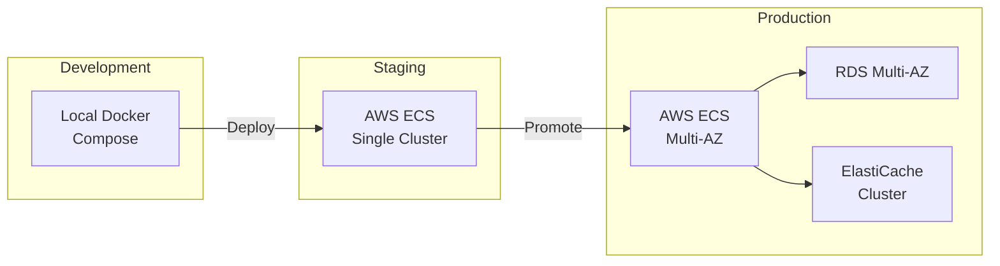
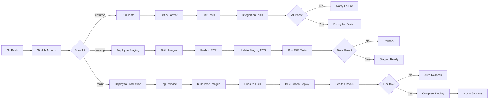
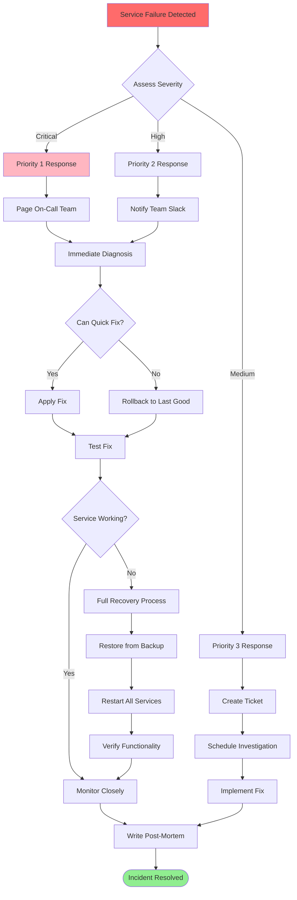

# Deployment and Operations Guide
## Alpha 0.9 - Production Deployment Procedures

**Version:** 0.9.0-alpha  
**Date:** November 2, 2025  

---

## Table of Contents
1. [Deployment Architecture](#deployment-architecture)
2. [Deployment Procedures](#deployment-procedures)
3. [Operations Runbook](#operations-runbook)
4. [Monitoring and Alerting](#monitoring-and-alerting)
5. [Backup and Recovery](#backup-and-recovery)
6. [Troubleshooting Guide](#troubleshooting-guide)

---

## Deployment Architecture

### Deployment Environments



### Infrastructure as Code

```
Deployment Stack:

┌─────────────────────────────────────────┐
│     INFRASTRUCTURE LAYERS               │
├─────────────────────────────────────────┤
│                                         │
│  Layer 1: Cloud Provider (AWS)         │
│  └─ VPC, Subnets, Security Groups      │
│  └─ Managed via: Terraform/CloudForm   │
│                                         │
│  Layer 2: Container Orchestration      │
│  └─ ECS Fargate / Kubernetes           │
│  └─ Managed via: ECS CLI / kubectl     │
│                                         │
│  Layer 3: Application Services         │
│  └─ Docker containers                   │
│  └─ Managed via: docker-compose         │
│                                         │
│  Layer 4: Application Code             │
│  └─ Python FastAPI services            │
│  └─ Managed via: Git / CI/CD           │
│                                         │
└─────────────────────────────────────────┘
```

---

## Deployment Procedures

### Local Development Deployment

```bash
# ============================================================================
# Local Development Deployment (Docker Compose)
# ============================================================================

# Step 1: Clone repository
git clone https://github.com/your-org/lm-1.0.git
cd lm-1.0

# Step 2: Create environment file
cp .env.example .env
# Edit .env with your configuration

# Step 3: Generate secrets
python scripts/utilities/generate-secrets.py > .env.secrets
cat .env.secrets >> .env

# Step 4: Initialize database
docker-compose up -d postgres
sleep 10  # Wait for PostgreSQL to start
python database/scripts/deploy-schema.py

# Step 5: Start infrastructure services
docker-compose up -d redis chromadb ollama

# Step 6: Start application services
docker-compose up -d auth-service llm-service stt-service tts-service
docker-compose up -d recording-service class-management-service
docker-compose up -d content-capture-service ai-study-tools-service
docker-compose up -d social-collaboration-service gamification-service

# Step 7: Start gateway
docker-compose up -d nginx

# Step 8: Start frontend (separate terminal)
cd views/web-app
npm install
npm run dev

# Step 9: Verify all services
curl http://localhost/health
curl http://localhost:8001/health
curl http://localhost:8005/health
# ... check all services

# Step 10: Run tests
pytest tests/integration/
pytest tests/e2e/

# Access:
# - Web App: http://localhost:3000
# - API Gateway: http://localhost:80
# - Adminer: http://localhost:8080
```

### Production AWS Deployment

```bash
# ============================================================================
# AWS Production Deployment (ECS Fargate)
# ============================================================================

# Prerequisites:
# - AWS CLI configured
# - Docker installed
# - ECR repositories created
# - VPC and subnets configured
# - RDS PostgreSQL database running
# - ElastiCache Redis cluster running

# Step 1: Build and tag Docker images
./scripts/deployment/build-images.sh

# Output:
# - lm-auth:latest
# - lm-llm:latest
# - lm-stt:latest
# - lm-tts:latest
# - lm-recording:latest
# - lm-class-mgmt:latest
# - lm-content-capture:latest
# - lm-ai-study-tools:latest
# - lm-social-collab:latest
# - lm-gamification:latest
# - lm-gateway:latest

# Step 2: Push images to ECR
./scripts/deployment/push-to-ecr.sh

# Step 3: Update ECS task definitions
./scripts/deployment/update-task-definitions.sh

# Step 4: Deploy services (blue-green deployment)
./scripts/deployment/deploy-to-ecs.sh --environment production

# Deployment process:
# 1. Create new task definition revision
# 2. Update service with new task definition
# 3. ECS starts new tasks
# 4. Health checks pass on new tasks
# 5. Traffic shifts to new tasks
# 6. Old tasks drained and terminated
# 7. Rollback automatic if health checks fail

# Step 5: Run database migrations
./scripts/deployment/run-migrations.sh --environment production

# Step 6: Verify deployment
./scripts/deployment/verify-deployment.sh --environment production

# Step 7: Smoke tests
./scripts/deployment/smoke-tests.sh

# Step 8: Monitor deployment
aws ecs describe-services --cluster lm-production --services lm-auth
aws cloudwatch get-metric-statistics \
  --namespace AWS/ECS \
  --metric-name CPUUtilization \
  --dimensions Name=ServiceName,Value=lm-auth \
  --start-time 2025-11-02T00:00:00Z \
  --end-time 2025-11-03T00:00:00Z \
  --period 3600 \
  --statistics Average
```

### CI/CD Pipeline



---

## Operations Runbook

### Service Start/Stop Procedures

```bash
# ============================================================================
# Service Lifecycle Management
# ============================================================================

# Start all services
docker-compose up -d

# Start specific service
docker-compose up -d auth-service

# Stop all services
docker-compose down

# Stop specific service
docker-compose stop auth-service

# Restart service (with rebuild)
docker-compose up -d --build auth-service

# View logs
docker-compose logs -f auth-service

# View logs for all services
docker-compose logs -f

# Scale service
docker-compose up -d --scale llm-service=3

# Check service status
docker-compose ps

# Execute command in container
docker-compose exec auth-service /bin/bash

# View resource usage
docker stats
```

### Health Check Procedures

```bash
# ============================================================================
# Health Check Commands
# ============================================================================

# Check all services via gateway
curl http://localhost/health

# Check individual services
curl http://localhost:8001/health  # Auth
curl http://localhost:8002/health  # STT
curl http://localhost:8003/health  # TTS
curl http://localhost:8004/health  # Recording
curl http://localhost:8005/health  # LLM
curl http://localhost:8006/health  # Class Management
curl http://localhost:8008/health  # Content Capture
curl http://localhost:8009/health  # AI Study Tools
curl http://localhost:8010/health  # Social
curl http://localhost:8011/health  # Gamification
curl http://localhost:8012/health  # Analytics
curl http://localhost:8013/health  # Notifications

# Check infrastructure
docker exec lm-postgres pg_isready
docker exec lm-redis redis-cli ping
curl http://localhost:8000/api/v1/heartbeat  # ChromaDB
curl http://localhost:11434/api/tags  # Ollama

# Expected responses: All return 200 OK with JSON
{
  "status": "healthy",
  "service": "service-name",
  "version": "1.0.0",
  "dependencies": {
    "database": "connected",
    "redis": "connected"
  }
}
```

### Database Operations

```bash
# ============================================================================
# Database Operations
# ============================================================================

# Connect to database
docker exec -it lm-postgres psql -U postgres -d littlemonster

# Run schema migrations
python database/scripts/deploy-schema.py

# Backup database
docker exec lm-postgres pg_dump -U postgres littlemonster > backup_$(date +%Y%m%d).sql

# Restore database
docker exec -i lm-postgres psql -U postgres littlemonster < backup_20251102.sql

# Verify tables
python database/scripts/verify_tables.py

# Seed database with test data
python database/seeds/seed_all.py

# Check database size
docker exec lm-postgres psql -U postgres -c "
SELECT pg_size_pretty(pg_database_size('littlemonster'));"

# Check connection count
docker exec lm-postgres psql -U postgres -c "
SELECT count(*) FROM pg_stat_activity WHERE datname='littlemonster';"

# Kill idle connections (if needed)
docker exec lm-postgres psql -U postgres -c "
SELECT pg_terminate_backend(pid) 
FROM pg_stat_activity 
WHERE datname = 'littlemonster' 
AND state = 'idle' 
AND state_change < now() - interval '1 hour';"
```

---

## Monitoring and Alerting

### Key Performance Indicators

```
Service Health Metrics:

┌─────────────────────────────────────────────────────┐
│  CRITICAL METRICS (Alert Immediately)               │
├─────────────────────────────────────────────────────┤
│  • Service availability < 99.5%                     │
│  • Response time P95 > 1000ms                       │
│  • Error rate > 1%                                  │
│  • Database connection pool > 90%                   │
│  • Redis memory > 90%                               │
│  • Disk usage > 85%                                 │
│  • CPU usage > 80% (sustained 5min)                │
└─────────────────────────────────────────────────────┘

┌─────────────────────────────────────────────────────┐
│  WARNING METRICS (Investigate Soon)                 │
├─────────────────────────────────────────────────────┤
│  • Response time P95 > 500ms                        │
│  • Error rate > 0.5%                                │
│  • Queue depth > 100                                │
│  • Failed job rate > 5%                             │
│  • Memory usage > 75%                               │
└─────────────────────────────────────────────────────┘

┌─────────────────────────────────────────────────────┐
│  INFORMATIONAL METRICS (Track Trends)               │
├─────────────────────────────────────────────────────┤
│  • Request rate trends                              │
│  • User growth rate                                 │
│  • Feature adoption                                 │
│  • Cost per user                                    │
│  • LLM token usage                                  │
└─────────────────────────────────────────────────────┘
```

### Monitoring Commands

```bash
# ============================================================================
# Monitoring Commands
# ============================================================================

# View real-time container stats
docker stats

# View service logs
docker-compose logs --tail=100 -f auth-service

# View error logs only
docker-compose logs auth-service 2>&1 | grep ERROR

# Check container resource usage
docker inspect lm-auth | grep -A 10 "Memory"

# View network connections
docker exec lm-auth netstat -tupln

# Check database connections
docker exec lm-postgres psql -U postgres -c "
SELECT pid, usename, application_name, state, query_start
FROM pg_stat_activity
WHERE datname = 'littlemonster'
ORDER BY query_start DESC
LIMIT 20;"

# Check Redis memory usage
docker exec lm-redis redis-cli INFO memory

# Check Redis key count
docker exec lm-redis redis-cli DBSIZE

# View slow queries (PostgreSQL)
docker exec lm-postgres psql -U postgres -d littlemonster -c "
SELECT query, mean_exec_time, calls
FROM pg_stat_statements
ORDER BY mean_exec_time DESC
LIMIT 10;"
```

### Log Aggregation

```
Centralized Logging Architecture:

┌─────────────┐     ┌─────────────┐     ┌─────────────┐
│  Service 1  │────▶│  FluentBit  │────▶│ CloudWatch  │
└─────────────┘     │  (or)       │     │  Logs       │
                    │  Filebeat   │     │             │
┌─────────────┐     └─────────────┘     └─────────────┘
│  Service 2  │────▶        │                   │
└─────────────┘             │                   ▼
                            │            ┌─────────────┐
┌─────────────┐             │            │ Elasticsearch│
│  Service N  │────▶        │            │  (optional)  │
└─────────────┘             │            └─────────────┘
                            │                   │
                            │                   ▼
                            │            ┌─────────────┐
                            └───────────▶│   Kibana    │
                                        │  Dashboard  │
                                        └─────────────┘

Log Format (JSON):
{
  "timestamp": "2025-11-02T23:00:00Z",
  "service": "auth-service",
  "level": "INFO",
  "message": "User login successful",
  "user_id": "uuid",
  "request_id": "req-123",
  "duration_ms": 45
}
```

---

## Backup and Recovery

### Backup Strategy

```
Backup Schedule:

┌────────────────────────────────────────────────────┐
│              BACKUP TIERS                          │
├────────────────────────────────────────────────────┤
│                                                    │
│  Tier 1: Continuous (WAL Archiving)              │
│  └─ PostgreSQL Write-Ahead Logs                   │
│  └─ Frequency: Continuous                          │
│  └─ Retention: 7 days                             │
│  └─ Recovery: Point-in-time                        │
│                                                    │
│  Tier 2: Hourly Snapshots                         │
│  └─ Redis RDB snapshots                           │
│  └─ Frequency: Every hour                          │
│  └─ Retention: 24 hours                           │
│  └─ Recovery: Last known good state               │
│                                                    │
│  Tier 3: Daily Full Backups                       │
│  └─ PostgreSQL pg_dump                            │
│  └─ Vector database exports                        │
│  └─ Frequency: Daily at 2 AM UTC                  │
│  └─ Retention: 30 days                            │
│  └─ Recovery: Full restore                         │
│                                                    │
│  Tier 4: Weekly Archives                          │
│  └─ Complete system backup                         │
│  └─ Frequency: Sunday at 3 AM UTC                 │
│  └─ Retention: 90 days                            │
│  └─ Recovery: Disaster recovery                    │
│                                                    │
└────────────────────────────────────────────────────┘
```

### Backup Commands

```bash
# ============================================================================
# Backup Commands
# ============================================================================

# Full PostgreSQL backup
docker exec lm-postgres pg_dump -U postgres -Fc littlemonster \
  > backups/lm_full_$(date +%Y%m%d_%H%M%S).dump

# Backup specific tables
docker exec lm-postgres pg_dump -U postgres -t users -t sessions \
  littlemonster > backups/users_sessions_$(date +%Y%m%d).sql

# Backup with compression
docker exec lm-postgres pg_dump -U postgres littlemonster | \
  gzip > backups/lm_$(date +%Y%m%d).sql.gz

# Export Redis data
docker exec lm-redis redis-cli --rdb backups/redis_dump.rdb

# Backup ChromaDB
docker exec lm-chroma chroma utils backup \
  --path /chroma/chroma \
  --destination /backups/chroma_$(date +%Y%m%d).tar.gz

# Backup to S3 (production)
aws s3 cp backups/lm_full_20251102.dump \
  s3://lm-backups/$(date +%Y%m%d)/

# Automated backup script (cron)
# Add to crontab: 0 2 * * * /path/to/backup-script.sh
cat > /usr/local/bin/backup-lm.sh << 'EOF'
#!/bin/bash
TIMESTAMP=$(date +%Y%m%d_%H%M%S)
BACKUP_DIR=/backups/lm

# PostgreSQL
docker exec lm-postgres pg_dump -U postgres -Fc littlemonster \
  > $BACKUP_DIR/postgres_$TIMESTAMP.dump

# Redis
docker exec lm-redis redis-cli BGSAVE

# Upload to S3
aws s3 sync $BACKUP_DIR s3://lm-backups/$(date +%Y%m%d)/

# Clean old local backups (keep 7 days)
find $BACKUP_DIR -name "*.dump" -mtime +7 -delete

echo "Backup completed: $TIMESTAMP"
EOF
chmod +x /usr/local/bin/backup-lm.sh
```

### Recovery Procedures

```bash
# ============================================================================
# Recovery Procedures
# ============================================================================

# 1. Point-in-Time Recovery (PostgreSQL)
# Restore to specific timestamp using WAL replay

# Stop services
docker-compose stop

# Restore base backup
docker exec -i lm-postgres psql -U postgres littlemonster < base_backup.sql

# Replay WAL logs up to target time
docker exec lm-postgres pg_waldump \
  --timeline=1 \
  --end="2025-11-02 23:00:00" \
  /var/lib/postgresql/data/pg_wal/*

# 2. Full Database Restore
# Restore from pg_dump file

# Create new database (if needed)
docker exec lm-postgres psql -U postgres -c "DROP DATABASE IF EXISTS littlemonster;"
docker exec lm-postgres psql -U postgres -c "CREATE DATABASE littlemonster;"

# Restore
docker exec -i lm-postgres pg_restore -U postgres -d littlemonster \
  < backups/lm_full_20251102.dump

# 3. Redis Restore
docker exec lm-redis redis-cli SHUTDOWN SAVE
docker cp backups/redis_dump.rdb lm-redis:/data/dump.rdb
docker-compose restart redis

# 4. Verify Recovery
python scripts/utilities/validate_system.py

# 5. Restart services
docker-compose up -d

# 6. Run smoke tests
./scripts/deployment/smoke-tests.sh
```

---

## Troubleshooting Guide

### Common Issues and Solutions

```
┌─────────────────────────────────────────────────────────────┐
│                  TROUBLESHOOTING MATRIX                      │
├─────────────────────────────────────────────────────────────┤
│                                                              │
│  Issue: Service won't start                                 │
│  ├─ Check: Docker logs (docker logs lm-service)            │
│  ├─ Check: Port conflicts (netstat -tuln | grep PORT)      │
│  ├─ Check: Environment variables (.env file)               │
│  └─ Solution: Fix config, restart service                   │
│                                                              │
│  Issue: High CPU usage                                      │
│  ├─ Check: Container stats (docker stats)                  │
│  ├─ Check: Slow queries (pg_stat_statements)               │
│  ├─ Check: Infinite loops in code                          │
│  └─ Solution: Optimize queries, scale horizontally          │
│                                                              │
│  Issue: Out of memory                                       │
│  ├─ Check: Container limits (docker inspect)               │
│  ├─ Check: Memory leaks (heap dumps)                       │
│  ├─ Check: Large file uploads                              │
│  └─ Solution: Increase limits, fix leaks, add limits       │
│                                                              │
│  Issue: Database connection errors                          │
│  ├─ Check: Max connections (SHOW max_connections;)         │
│  ├─ Check: Connection pool settings                         │
│  ├─ Check: Long-running transactions                        │
│  └─ Solution: Increase max_connections, kill idle          │
│                                                              │
│  Issue: Slow API responses                                  │
│  ├─ Check: Database query performance                       │
│  ├─ Check: Network latency (ping service)                  │
│  ├─ Check: External API timeouts                           │
│  └─ Solution: Add indexes, cache, optimize code            │
│                                                              │
│  Issue: 502 Bad Gateway                                     │
│  ├─ Check: Target service health                           │
│  ├─ Check: Nginx upstream config                           │
│  ├─ Check: Service restart in progress                      │
│  └─ Solution: Restart service, check logs                   │
│                                                              │
│  Issue: Redis out of memory                                 │
│  ├─ Check: Memory usage (INFO memory)                      │
│  ├─ Check: Key count and sizes                             │
│  ├─ Check: Eviction policy                                 │
│  └─ Solution: Increase memory, adjust eviction             │
│                                                              │
└─────────────────────────────────────────────────────────────┘
```

### Debug Mode

```bash
# ============================================================================
# Enable Debug Mode
# ============================================================================

# Set LOG_LEVEL=DEBUG in .env
echo "LOG_LEVEL=DEBUG" >> .env

# Restart services
docker-compose restart

# View verbose logs
docker-compose logs -f --tail=1000

# Enable SQL query logging
echo "DB_ECHO=true" >> .env
docker-compose restart auth-service

# Test specific endpoint with verbose output
curl -v -H "Authorization: Bearer $TOKEN" \
  http://localhost/api/auth/me

# Profile a service
docker exec lm-auth python -m cProfile -s cumtime src/main.py

# Memory profiling
docker exec lm-auth python -m memory_profiler src/main.py
```

---

## Scaling Procedures

### Horizontal Scaling

```bash
# ============================================================================
# Horizontal Scaling
# ============================================================================

# Scale specific service
docker-compose up -d --scale llm-service=3

# Production scaling (AWS ECS)
aws ecs update-service \
  --cluster lm-production \
  --service lm-llm \
  --desired-count 5

# Auto-scaling policy (AWS)
aws application-autoscaling register-scalable-target \
  --service-namespace ecs \
  --scalable-dimension ecs:service:DesiredCount \
  --resource-id service/lm-production/lm-llm \
  --min-capacity 2 \
  --max-capacity 10

aws application-autoscaling put-scaling-policy \
  --service-namespace ecs \
  --scalable-dimension ecs:service:DesiredCount \
  --resource-id service/lm-production/lm-llm \
  --policy-name lm-llm-cpu-scaling \
  --policy-type TargetTrackingScaling \
  --target-tracking-scaling-policy-configuration \
    '{"TargetValue":70.0,"PredefinedMetricSpecification":{"PredefinedMetricType":"ECSServiceAverageCPUUtilization"}}'
```

### Vertical Scaling

```yaml
# Update docker-compose.yml resource limits

services:
  llm-service:
    deploy:
      resources:
        limits:
          cpus: '4.0'    # Increase from 2.0
          memory: 4096M  # Increase from 2048M
        reservations:
          cpus: '2.0'
          memory: 2048M
```

---

## Disaster Recovery

### Recovery Time Objectives

```
RTO/RPO Targets:

┌──────────────────┬─────────┬─────────┬──────────────┐
│ Severity         │   RTO   │   RPO   │   Priority   │
├──────────────────┼─────────┼─────────┼──────────────┤
│ Critical         │  5 min  │  5 min  │      1       │
│ (Auth down)      │         │         │              │
├──────────────────┼─────────┼─────────┼──────────────┤
│ High             │ 15 min  │ 15 min  │      2       │
│ (Core services)  │         │         │              │
├──────────────────┼─────────┼─────────┼──────────────┤
│ Medium           │  1 hour │ 30 min  │      3       │
│ (Optional feat)  │         │         │              │
├──────────────────┼─────────┼─────────┼──────────────┤
│ Low              │  4 hours│  1 hour │      4       │
│ (Analytics)      │         │         │              │
└──────────────────┴─────────┴─────────┴──────────────┘

RTO = Recovery Time Objective (max downtime)
RPO = Recovery Point Objective (max data loss)
```

### Disaster Recovery Plan



---

## Maintenance Windows

### Planned Maintenance Procedure

```
Maintenance Window Process:

Week Before:
├─ Schedule maintenance window
├─ Notify users via email/in-app
├─ Prepare rollback plan
└─ Test in staging environment

Day Before:
├─ Final testing in staging
├─ Prepare deployment scripts
├─ Brief team on procedures
└─ Confirm maintenance window

During Maintenance:
├─ T-0:00 - Enable maintenance mode
├─ T-0:05 - Stop accepting new requests
├─ T-0:10 - Backup current state
├─ T-0:15 - Deploy new version
├─ T-0:30 - Run database migrations
├─ T-0:45 - Start new services
├─ T-1:00 - Health checks & smoke tests
├─ T-1:15 - Re-enable traffic
└─ T-1:30 - Monitor for issues

After Maintenance:
├─ Monitor metrics for 2 hours
├─ Check error logs
├─ Verify user reports
├─ Send completion notification
└─ Document any issues

Rollback Criteria:
├─ Error rate > 2%
├─ Response time > 2x baseline
├─ Critical feature broken
└─ Database corruption detected
```

---

## Performance Tuning

### Database Performance Tuning

```sql
-- Performance tuning queries

-- 1. Identify slow queries
SELECT 
    query,
    calls,
    total_exec_time,
    mean_exec_time,
    max_exec_time
FROM pg_stat_statements
ORDER BY mean_exec_time DESC
LIMIT 20;

-- 2. Find missing indexes
SELECT 
    schemaname,
    tablename,
    attname,
    n_distinct,
    correlation
FROM pg_stats
WHERE schemaname = 'public'
AND n_distinct > 100
