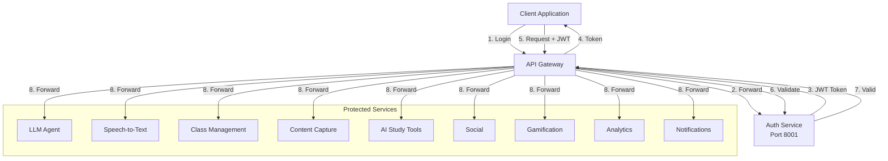
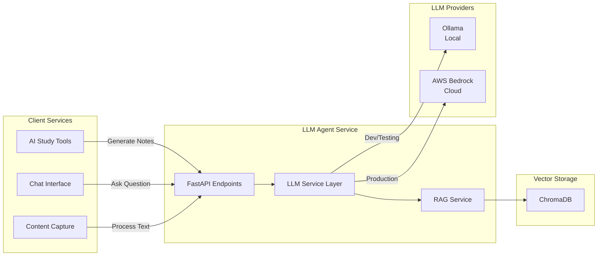
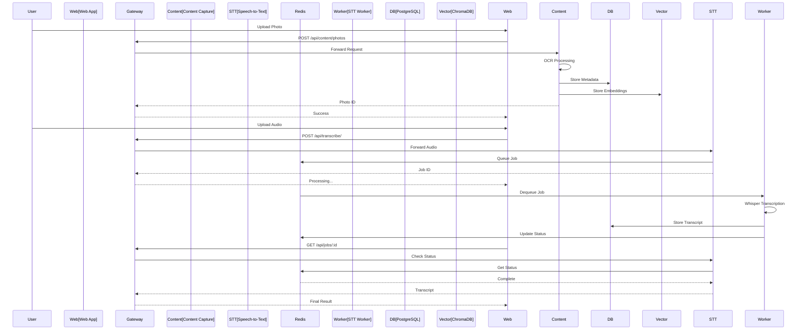
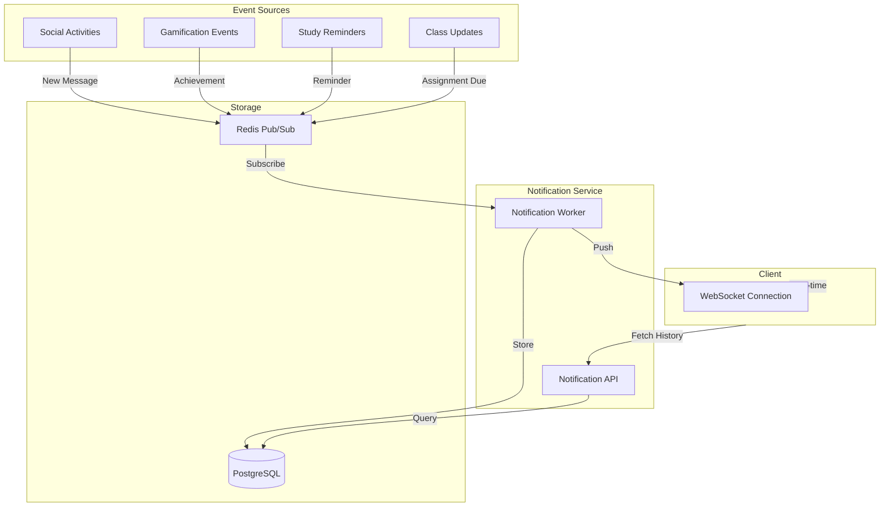
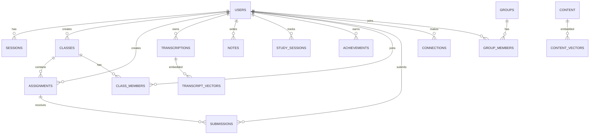
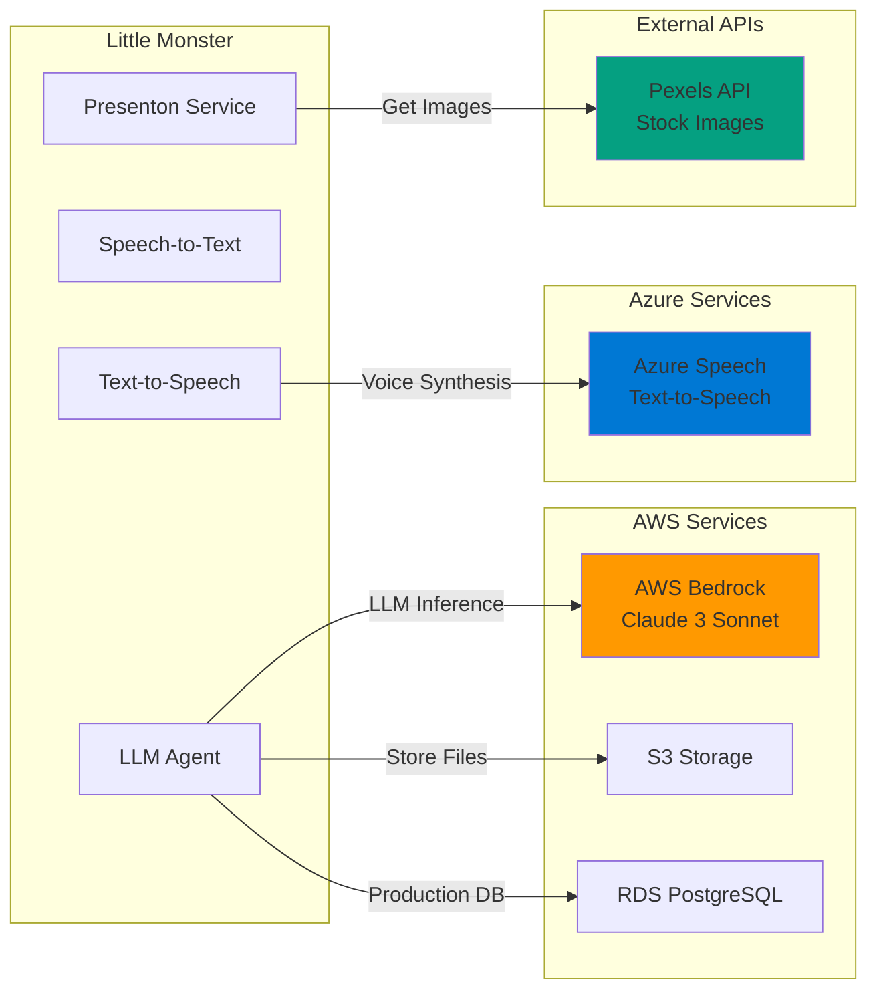
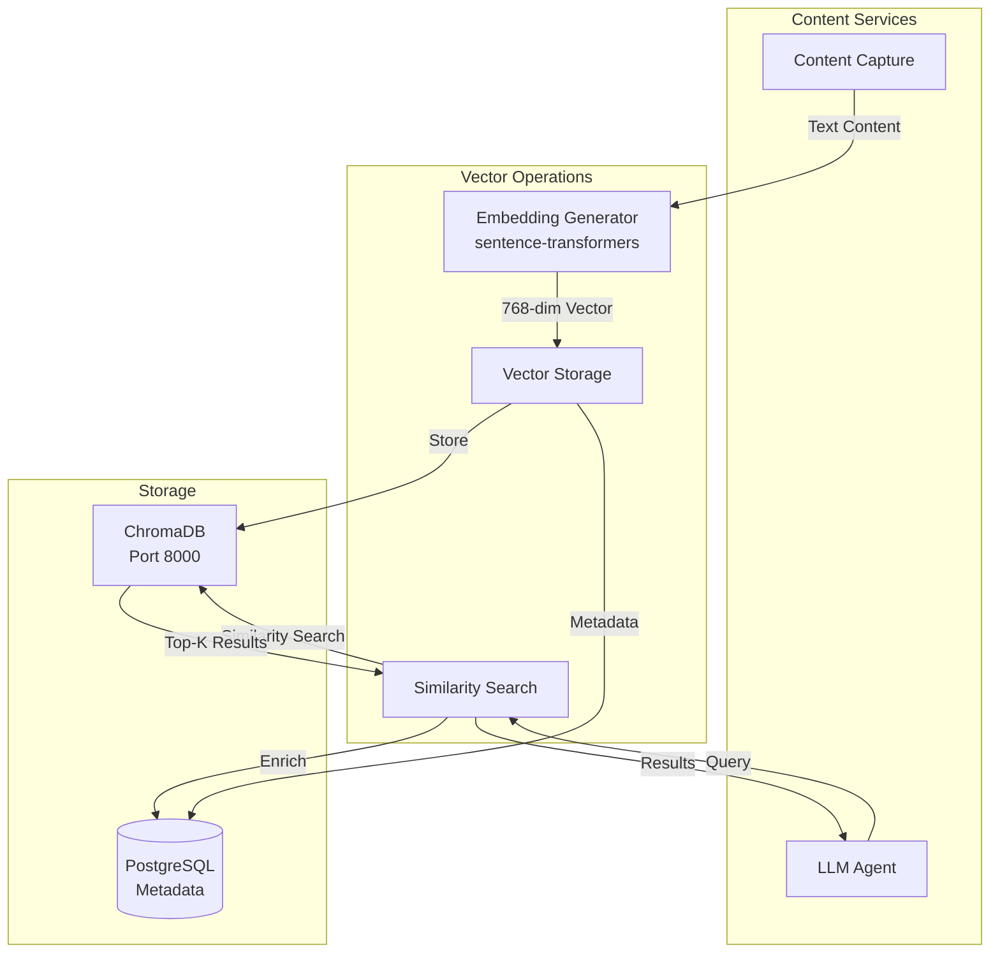

# Integration Architecture
## Alpha 0.9 - Service Integration Patterns

**Version:** 0.9.0-alpha  
**Date:** November 2, 2025  

---

## Table of Contents
1. [Integration Overview](#integration-overview)
2. [Service Integration Patterns](#service-integration-patterns)
3. [Data Integration](#data-integration)
4. [External Integrations](#external-integrations)
5. [Message Flow Patterns](#message-flow-patterns)

---

## Integration Overview

Little Monster uses multiple integration patterns to enable seamless service communication while maintaining loose coupling.

### Integration Patterns Used

```
┌─────────────────────────────────────────────────────────┐
│           INTEGRATION PATTERNS                           │
├─────────────────────────────────────────────────────────┤
│                                                          │
│  1. API Gateway Pattern                                 │
│     └─ Central entry point for all client requests     │
│                                                          │
│  2. Service Mesh (Docker Network)                       │
│     └─ Internal service-to-service communication       │
│                                                          │
│  3. Database per Service                                │
│     └─ Shared PostgreSQL with logical separation       │
│                                                          │
│  4. Async Messaging (Redis Queues)                     │
│     └─ Background job processing                        │
│                                                          │
│  5. Event-Driven (Future)                              │
│     └─ Pub/Sub for real-time features                  │
│                                                          │
└─────────────────────────────────────────────────────────┘
```

---

## Service Integration Patterns

### 1. Authentication Integration

All services integrate with authentication for request validation.



### 2. LLM Integration Pattern

Multiple services can leverage LLM capabilities through the LLM Agent service.



### 3. Content Processing Integration



### 4. Real-Time Features Integration



---

## Data Integration

### Database Schema Integration



### Shared Data Patterns

```
Data Consistency Strategies:

1. User Data:
   ┌──────────────┐
   │  Auth Service│ ─ Master source of user data
   └──────┬───────┘
          │
          ├─▶ Other services cache user info
          └─▶ User ID used as foreign key

2. Content Vectors:
   ┌───────────────┐
   │  ChromaDB     │ ─ Vector embeddings
   └───────┬───────┘
           │
           └─▶ Metadata in PostgreSQL
               └─▶ vector_id references ChromaDB

3. Async Jobs:
   ┌──────────────┐
   │  Redis Queue │ ─ Job state
   └──────┬───────┘
          │
          └─▶ Job results in PostgreSQL
              └─▶ job_id for status checks
```

---

## External Integrations

### Third-Party Service Integrations



### External API Configuration

| Service | Provider | Purpose | Auth Method | Cost |
|---------|----------|---------|-------------|------|
| **LLM** | AWS Bedrock | Production AI inference | AWS IAM | Pay-per-token |
| **LLM** | Ollama | Development AI | None | Free |
| **TTS** | Azure Speech | Voice synthesis | API Key | Pay-per-character |
| **Images** | Pexels | Stock photos for PPTs | API Key | Free tier available |
| **Storage** | AWS S3 | File storage (prod) | AWS IAM | Pay-per-GB |
| **Database** | AWS RDS | Production database | VPC Security | Pay-per-hour |
| **Cache** | AWS ElastiCache | Production Redis | VPC Security | Pay-per-hour |

---

## Message Flow Patterns

### Synchronous Request Pattern

```
Simple CRUD Operations:

Client                  Gateway                 Service                 Database
  │                       │                       │                       │
  ├─ HTTP Request ───────▶│                       │                       │
  │                       ├─ Route ──────────────▶│                       │
  │                       │                       ├─ Query ──────────────▶│
  │                       │                       │◀─ Data ───────────────┤
  │                       │◀─ Response ───────────┤                       │
  │◀─ HTTP Response ──────┤                       │                       │
  │                       │                       │                       │

Typical Response Time: < 100ms
Used For: Login, fetch data, simple updates
```

### Asynchronous Job Pattern

```
Long-Running Operations:

Client              Gateway          Service          Redis Queue        Worker
  │                   │                │                  │                │
  ├─ Upload Audio ───▶│                │                  │                │
  │                   ├─ POST /api ───▶│                  │                │
  │                   │                ├─ Queue Job ─────▶│                │
  │                   │                │                  │                │
  │                   │◀─ Job ID ──────┤                  │                │
  │◀─ 202 Accepted ───┤                │                  │                │
  │                   │                │                  │                │
  │                   │                │                  ├─ Dequeue ─────▶│
  │                   │                │                  │                │
  │                   │                │                  │                │
  ├─ Poll Status ────▶│                │                  │                │
  │                   ├─ GET /jobs/:id▶│                  │                │
  │                   │                ├─ Check Status ──▶│                │
  │                   │                │◀─ Processing ────┤                │
  │◀─ Processing... ──┤                │                  │                │
  │                   │                │                  │◀─ Complete ────┤
  │                   │                │                  │                │
  ├─ Poll Status ────▶│                │                  │                │
  │                   ├─ GET /jobs/:id▶│                  │                │
  │                   │                ├─ Check Status ──▶│                │
  │                   │                │◀─ Complete ──────┤                │
  │◀─ Result ─────────┤                │                  │                │

Typical Processing Time: 10s - 5min
Used For: Transcription, PPT generation, AI analysis
```

### Event-Driven Pattern (Future)

```
Real-Time Notifications:

User A              Notification Service         Redis Pub/Sub         User B
  │                        │                          │                  │
  ├─ Send Message ────────▶│                          │                  │
  │                        ├─ Publish Event ─────────▶│                  │
  │                        │                          │                  │
  │                        │                          ├─ Subscribe ─────▶│
  │                        │                          │                  │
  │                        │◀─ Ack ───────────────────┤                  │
  │◀─ Sent ────────────────┤                          │                  │
  │                        │                          ├─ Push ──────────▶│
  │                        │                          │                  │
  │                        │                          │                  ├─ Display
  │                        │                          │                  │

Typical Latency: < 100ms
Used For: Chat, notifications, live updates
```

---

## API Integration Specification

### REST API Standards

All services follow consistent API design:

```
API Design Standards:

1. URL Structure:
   /api/{service}/{resource}/{id}/{action}
   
   Examples:
   - POST   /api/auth/register
   - POST   /api/auth/login
   - GET    /api/classes/{class_id}
   - POST   /api/classes/{class_id}/assignments
   - POST   /api/transcribe/audio
   - GET    /api/chat/conversations/{conversation_id}

2. HTTP Methods:
   - GET    → Retrieve resource(s)
   - POST   → Create new resource
   - PUT    → Update entire resource
   - PATCH  → Update partial resource
   - DELETE → Remove resource

3. Status Codes:
   - 200 OK              → Success (GET, PUT, PATCH)
   - 201 Created         → Success (POST)
   - 202 Accepted        → Async job queued
   - 204 No Content      → Success (DELETE)
   - 400 Bad Request     → Invalid input
   - 401 Unauthorized    → Missing/invalid token
   - 403 Forbidden       → Insufficient permissions
   - 404 Not Found       → Resource doesn't exist
   - 409 Conflict        → Resource conflict
   - 422 Unprocessable   → Validation error
   - 500 Internal Error  → Server error
   - 503 Service Unavail → Service down

4. Response Format (Success):
   {
     "success": true,
     "data": { ... },
     "meta": {
       "timestamp": "2025-11-02T23:00:00Z",
       "request_id": "uuid"
     }
   }

5. Response Format (Error):
   {
     "success": false,
     "error": {
       "code": "INVALID_INPUT",
       "message": "Email is required",
       "details": { "field": "email" }
     },
     "meta": {
       "timestamp": "2025-11-02T23:00:00Z",
       "request_id": "uuid"
     }
   }

6. Authentication Header:
   Authorization: Bearer <JWT_TOKEN>

7. Content-Type:
   - application/json (default)
   - multipart/form-data (file uploads)
   - audio/mpeg (audio streaming)
```

### Service-to-Service Communication

```
Internal Service Calls:

┌─────────────────┐         ┌─────────────────┐
│  AI Study Tools │────────▶│   LLM Agent     │
│  Port 8009      │         │   Port 8005     │
└─────────────────┘         └─────────────────┘

Request:
POST http://lm-llm:8000/chat/completions
Content-Type: application/json
Authorization: Bearer <SERVICE_TOKEN>

{
  "messages": [
    {"role": "user", "content": "Explain photosynthesis"}
  ],
  "model": "claude-3-sonnet",
  "max_tokens": 1000
}

Response:
{
  "id": "msg_123",
  "content": "Photosynthesis is...",
  "model": "claude-3-sonnet",
  "usage": {
    "prompt_tokens": 20,
    "completion_tokens": 150,
    "total_tokens": 170
  }
}

┌─────────────────┐         ┌─────────────────┐
│ Content Capture │────────▶│ Speech-to-Text  │
│  Port 8008      │         │   Port 8002     │
└─────────────────┘         └─────────────────┘

Request:
POST http://lm-stt:8000/transcribe/audio
Content-Type: multipart/form-data
Authorization: Bearer <SERVICE_TOKEN>

--boundary
Content-Disposition: form-data; name="file"; filename="lecture.mp3"
Content-Type: audio/mpeg

<audio binary data>
--boundary--

Response:
{
  "job_id": "job_456",
  "status": "queued",
  "estimated_time": 120
}
```

---

## Data Synchronization

### Cache Strategy

```
Cache Hierarchy:

┌────────────────────────────────────────┐
│         CACHE LAYERS                    │
├────────────────────────────────────────┤
│                                         │
│  Layer 1: Browser Cache                │
│  └─ Static assets, user preferences    │
│     TTL: 1 hour - 1 day                │
│                                         │
│  Layer 2: Redis Cache                  │
│  └─ Session data, API responses        │
│     TTL: 1 hour - 24 hours            │
│                                         │
│  Layer 3: Database                     │
│  └─ Source of truth                    │
│     TTL: Permanent                      │
│                                         │
└────────────────────────────────────────┘

Cache Invalidation:

┌──────────┐
│  Update  │
│  Request │
└────┬─────┘
     │
     ▼
┌────────────────┐
│  1. Update DB  │
└────┬───────────┘
     │
     ▼
┌────────────────┐
│  2. Delete     │
│     Redis Key  │
└────┬───────────┘
     │
     ▼
┌────────────────┐
│  3. Broadcast  │
│     to other   │
│     instances  │
└────────────────┘
```

### Vector Database Integration



---

## Integration Testing Strategy

### Testing Levels

```
Integration Test Pyramid:

                    ┌──────┐
                    │  E2E │  ← Full user workflows
                    └──────┘     5% of tests
                  ┌──────────┐
                  │   API    │  ← Service integration
                  │Integration│     15% of tests
                  └──────────┘
              ┌──────────────────┐
              │   Component      │  ← Service internals
              │   Integration    │     30% of tests
              └──────────────────┘
          ┌────────────────────────────┐
          │        Unit Tests          │  ← Individual functions
          │                            │     50% of tests
          └────────────────────────────┘

Test Coverage Requirements:
├─ Unit Tests:          > 80%
├─ Integration Tests:   > 60%
├─ API Tests:          > 90%
└─ E2E Tests:          Critical paths only
```

### Integration Test Example

```python
# Example: Test Content Capture → STT Integration

async def test_photo_to_transcription_flow():
    """
    Tests the complete flow:
    1. Upload photo with handwritten notes
    2. OCR extracts text
    3. If audio mentioned, trigger transcription
    4. Store in vector database
    5. Query via LLM
    """
    
    # 1. Upload photo
    response = await client.post(
        "/api/content/photos",
        files={"file": photo_bytes},
        headers={"Authorization": f"Bearer {token}"}
    )
    assert response.status_code == 201
    photo_id = response.json()["data"]["id"]
    
    # 2. Verify OCR completed
    await asyncio.sleep(2)  # Wait for async processing
    photo = await client.get(f"/api/content/photos/{photo_id}")
    assert photo.json()["data"]["ocr_text"] is not None
    
    # 3. If audio reference found, test transcription trigger
    if "audio" in photo.json()["data"]["ocr_text"].lower():
        # Upload referenced audio
        audio_response = await client.post(
            "/api/transcribe/audio",
            files={"file": audio_bytes}
        )
        assert audio_response.status_code == 202
        job_id = audio_response.json()["data"]["job_id"]
        
        # Wait for completion
        for _ in range(30):
            status = await client.get(f"/api/jobs/{job_id}")
            if status.json()["data"]["status"] == "completed":
                break
            await asyncio.sleep(2)
        
        assert status.json()["data"]["status"] == "completed"
    
    # 4. Verify vector storage
    vectors = await chroma_client.get_collection("content")
    assert len(vectors.get(ids=[photo_id])) > 0
    
    # 5. Test RAG query
    rag_response = await client.post(
        "/api/chat/completions",
        json={
            "messages": [{"role": "user", "content": "What did I photograph?"}],
            "use_rag": True
        }
    )
    assert response.status_code == 200
    assert photo_id in rag_response.json()["data"]["sources"]
```

---

## Failure Handling

### Circuit Breaker Pattern

```
Service Resilience:

Normal Operation:
┌────────┐        ┌────────┐
│Service │───────▶│External│
│   A    │◀───────│Service │
└────────┘ Success└────────┘

Failure Detected:
┌────────┐    X   ┌────────┐
│Service │─────X─▶│External│
│   A    │◀───X───│Service │
└────┬───┘ Fail   └────────┘
     │
     ▼
┌────────────────┐
│ Circuit OPEN   │
│ Use fallback   │
└────────────────┘

Recovery:
┌────────┐    ?   ┌────────┐
│Service │────?──▶│External│
│   A    │◀───?───│Service │
└────┬───┘ Test   └────────┘
     │
     ▼
┌────────────────┐
│ Circuit HALF   │
│ Test requests  │
└────┬───────────┘
     │
     ▼ Success
┌────────────────┐
│ Circuit CLOSED │
│ Normal flow    │
└────────────────┘
```

### Retry Strategy

```python
Integration Retry Policy:

# Exponential backoff for transient failures
retry_config = {
    "max_attempts": 3,
    "base_delay": 1,  # seconds
    "max_delay": 10,
    "multiplier": 2,
    "jitter": True
}

# Attempt 1: immediate
# Attempt 2: wait 1s + jitter
# Attempt 3: wait 2s + jitter
# Attempt 4: wait 4s + jitter (max 10s)

# Do NOT retry on:
# - 400 Bad Request (client error)
# - 401 Unauthorized (auth error)
# - 403 Forbidden (permission error)
# - 404 Not Found (resource missing)
# - 422 Validation Error (bad input)

# DO retry on:
# - 500 Internal Server Error
# - 502 Bad Gateway
# - 503 Service Unavailable
# - 504 Gateway Timeout
# - Network errors (connection refused, timeout)
```

---

## Integration Monitoring

### Key Metrics to Track

```
Service-Level Metrics:

┌─────────────────────────────────────────┐
│  REQUEST METRICS                         │
├─────────────────────────────────────────┤
│  • Request rate (req/sec)               │
│  • Response time (P50, P95, P99)        │
│  • Error rate (%)                        │
│  • Status code distribution             │
└─────────────────────────────────────────┘

┌─────────────────────────────────────────┐
│  INTEGRATION METRICS                     │
├─────────────────────────────────────────┤
│  • Service dependency health            │
│  • Circuit breaker state                │
│  • Retry attempts                        │
│  • Queue depth (Redis)                  │
│  • Worker processing time               │
└─────────────────────────────────────────┘

┌─────────────────────────────────────────┐
│  RESOURCE METRICS                        │
├─────────────────────────────────────────┤
│  • CPU usage per container              │
│  • Memory usage per container           │
│  • Network I/O                           │
│  • Disk I/O                             │
│  • Database connections                 │
│  • Redis memory usage                   │
└─────────────────────────────────────────┘
```

### Distributed Tracing (Future)

```mermaid
gantt
    title Request Trace (Distributed Tracing)
    dateFormat X
    axisFormat %S

    section Client
    HTTP Request           :0, 1
    
    section Gateway
    Route Request          :1, 1
    
    section Auth
    Validate Token         :2, 1
    Check DB              :2, 1
    
    section Service
    Process Request        :3, 2
    Query Database        :3, 1
    Cache Result          :4, 1
    
    section Response
    Return to Client       :5, 1
```



---

## Integration Patterns Best Practices

### 1. Idempotency

```
Idempotent Operations:

POST /api/classes
Body: {"name": "Math 101", "idempotency_key": "unique-key-123"}

First Request:
├─ Check idempotency_key in cache
├─ Not found
├─ Process request
├─ Store result with key
└─ Return 201 Created

Duplicate Request (within 24h):
├─ Check idempotency_key in cache
├─ Found!
├─ Return cached result
└─ Return 200 OK (not 201)

Benefits:
✓ Safe retries
✓ Network failure recovery
✓ Duplicate prevention
```

### 2. Rate Limiting

```
Rate Limit Strategy:

┌─────────────────────────────────────────┐
│         RATE LIMIT TIERS                 │
├─────────────────────────────────────────┤
│                                          │
│  Anonymous:        10 req/min            │
│  Authenticated:   100 req/min            │
│  Premium:        1000 req/min            │
│  Service-to-Service: Unlimited           │
│                                          │
│  Implementation:                          │
│  └─ Token bucket algorithm               │
│  └─ Redis-backed counter                 │
│  └─ Per-user tracking                    │
│                                          │
│  Headers Returned:                       │
│  X-RateLimit-Limit: 100                 │
│  X-RateLimit-Remaining: 75              │
│  X-RateLimit-Reset: 1699999999          │
│                                          │
└─────────────────────────────────────────┘
```

### 3. API Versioning

```
API Versioning Strategy:

Current: v1 (no version in URL)
├─ /api/auth/login
└─ /api/chat/completions

Future: v2 (version in URL when breaking changes)
├─ /api/v2/auth/login
└─ /api/v2/chat/completions

Header-based (alternative):
GET /api/chat/completions
Accept: application/vnd.lm.v1+json

Deprecation Process:
1. Announce new version (v2)
2. Support both v1 and v2 (6 months)
3. Mark v1 as deprecated (3 months warning)
4. Remove v1 support

Breaking Changes:
├─ Response structure change
├─ Required field added
├─ Field removed
├─ Data type change
└─ Behavior change

Non-Breaking Changes (same version):
├─ Optional field added
├─ New endpoint added
├─ Bug fix
└─ Performance improvement
```

---

## Error Propagation

### Error Handling Flow

```mermaid
graph TD
    A[Request] --> B{Service A}
    B -->|Call| C{Service B}
    C -->|Error| D{Error Type}
    
    D -->|4xx Client Error| E[Return to Caller]
    D -->|5xx Server Error| F{Retry?}
    D -->|Network Error| F
    
    F -->|Yes| G[Retry with Backoff]
    F -->|No| H[Return Error]
    
    G -->|Success| I[Return Result]
    G
